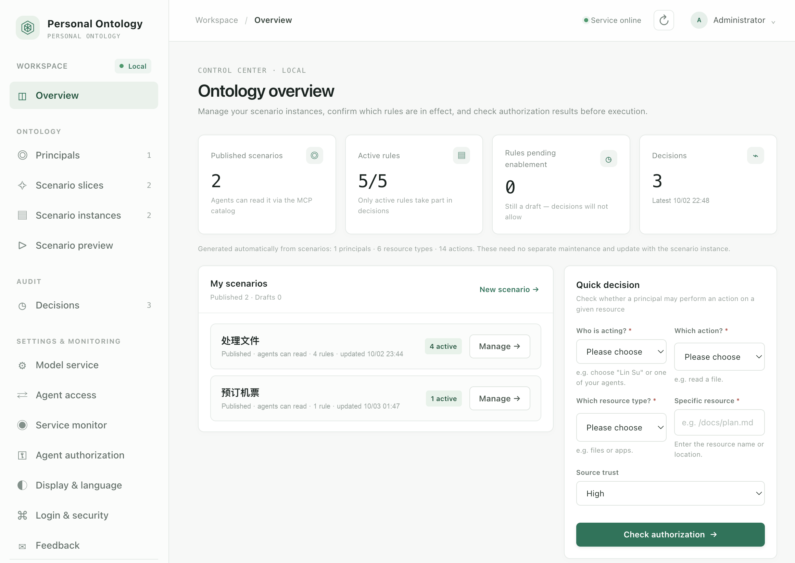

# Personal Ontology Governance System v3.1

> Full-stack bilingual (Chinese + English). The interface, data labels,
> backend messages, installation/user manuals, design documents and changelog must all exist
> in both languages. See `docs/00-first-principle-bilingual.md`.



> Status: v3.1 · macOS only · single user, runs locally · licensed GPL-3.0

**Positioning**: an agent that wants to act on your behalf must first ask this machine's decision
engine — the answer comes from rules you wrote in advance, and the engine **only adjudicates; it
never executes the action itself**.
Deny by default; deny outranks ask, ask outranks allow. Rules, scenarios and decision records stay
encrypted on this machine; by default an agent **receives only the verdict** (allow / deny / ask),
while reading ontology data requires a separate grant. Every decision is recorded.

This project contains a local FastAPI API, RDF/Turtle persistence, SHACL validation, an
authorization decision engine and a native HTML/CSS/JavaScript console. The services listen on
`127.0.0.1` only, and every `/v1` route requires a Bearer token.

## One-command install

On macOS, run this in the project directory:

```bash
bash ./install.sh
```

### Model configuration for scenario slicing

Open "Configuration & monitoring → Model service", enter an OpenAI-compatible service URL, a
model name and an optional API key, save, then use "Test connection" to verify it. Both cloud
services and locally hosted compatible endpoints are supported. Services configured in older
versions through `SCENARIO_LLM_BASE_URL`, `SCENARIO_LLM_MODEL` and `SCENARIO_LLM_API_KEY` are
migrated into the encrypted configuration on upgrade.

The model configuration (base URL, model name and API key) is stored together with the ontology data
inside the `model_service` section of the local encrypted container, `data/ontology.po.json`. Within
that section the API key is encrypted once more with a local key, and the key that decrypts it is
derived from your login passphrase and never written to disk. The `data/model-service.json` and
`data/model-service.key` files from earlier versions are kept only as a compatibility fallback (read
and written only when the container section is unavailable) and are not removed automatically.
The scenario description and the resource/action catalog are sent to the configured model service;
principal and authorization data are never sent with the request. Testing the connection sends one
short request, which the provider may bill according to its own rules.

The default install location is `~/personal-ontology`; override it with
`PERSONAL_ONTOLOGY_HOME=/your/path`. The script creates a Python virtual environment, installs
dependencies and registers a macOS LaunchAgent so the services start automatically after you log
in. Python 3.11 or newer is required. You set the login credentials yourself the first time you
open the console (see below).

```bash
~/personal-ontology/stop.sh
~/personal-ontology/start.sh
~/personal-ontology/status.sh
```

`status.sh` calls two public health-check endpoints and needs no credentials.

Two **loopback ports** run locally, and the split is deliberate:

| Port | Process | Responsibility |
|---|---|---|
| `127.0.0.1:8765` | Local console / service manager | Serves the console pages and frontend static files, the process and log management endpoints (`/manager/*`), and **reverse-proxies** `/v1/*` to the governance backend. **Always running.** |
| `127.0.0.1:8766` | Governance backend (ontology data + decision engine) | Serves the `/v1/*` data and decision APIs. Started, stopped and restarted on demand by the manager. |

The split exists so the system can rescue itself: if the backend crashes or its configuration is
broken, the manager is still running, the page still opens, and you can restart the backend from
"Configuration & monitoring → Service monitor" and inspect `data/server.log`. A single process
would kill the very page you were using to fix it. The browser only ever talks to 8765; 8766 does
not need to be exposed.

Opening http://127.0.0.1:8765 for the first time asks you to **set a login password** (at least 8
characters, at least 3 character classes). That password both logs you in and derives the
encryption key: the ontology data lives entirely in the encrypted container
`data/ontology.po.json`, and logging in unlocks it. On idle timeout or manual lock, the in-memory
key and data are discarded immediately. **If you forget the password the data cannot be
recovered.**

"Configuration & monitoring → Service monitor" shows the manager, the governance backend /
decision engine, frontend files, ontology and SHACL files, RDF storage, model configuration and
current MCP client sessions. While the backend is stopped the manager keeps running, and the page
can start or restart the backend and show `data/server.log`. `stop.sh` stops only the governance
backend; `start.sh` starts both the manager and the backend.

"Configuration & monitoring → Agent integration" provides MCP stdio configuration samples for
WorkBuddy and Meta Muse Code; copy one into the client, which then starts the local MCP
subprocess. The tools expose governance-catalog reads (the principal catalog is off by default),
authorization checks, scenario rehearsals and scenario feedback recording. An agent should first
check the instance's runtime required fields and preferences, and ask the user when information
is missing. One-off inputs stay in that run's record only; a standing preference is written back
to the instance only after the user explicitly confirms it. Instance updates record the user's own
words, before/after values, run id, timestamp and instance revision. An authorization check only
produces a decision and an audit record; it performs no real action. Consumer Meta Muse and Meta
Muse Code connect differently; do not paste a Muse Code MCP configuration into consumer Muse. An
MCP subprocess stops appearing as an online session once it exits.

Scenario preferences can be set to "shared across all cases" or "differentiated by context
dimensions". Global mode shows no dimensions; segmented mode can combine several dimensions (for
example city + trip type) and keeps multiple variants, each with its own preferences. Field codes
and display names are fixed by the model/system and only values are edited; a dimension row's
value matches a variant, while other rows become that variant's constraints. Information that
must be collected on every run stays in `required_inputs`, and dimension fields are added to the
required list automatically. The scenario-slice confirmation page and the scenario-instance
editor share one structure. A rehearsal matches variants exactly by the dimension values in the
request and returns "not applicable to this instance" rather than falling back to another variant.
The MCP catalog exposes the segmentation structure; when an agent feeds back a standing
preference for a segmented scenario it must pass `variant_id`, and every revision still records
the user's confirming words with before/after values.

The ontology data (all scenarios, rules and decision records) lives entirely in the encrypted
container `~/personal-ontology/data/ontology.po.json`; service logs are in `data/server.log`.
**Backing up means copying that one container file.** The key is derived from the login password
and is never written to disk, so **forgetting the password means the data is unrecoverable** —
keep the password in a password manager.

The services listen on loopback (`127.0.0.1`) only and **must not be exposed to the public
internet or a LAN**. MCP uses the stdio transport: the agent client starts a local subprocess, and
no network MCP port is opened.

**Cross-machine use**: MCP stdio cannot cross machines (a client can only start local processes),
and the current architecture has no network entry point for remote agents. If another machine's
agent really must use the ontology, go through an encrypted channel such as an SSH tunnel and keep
the local services on loopback. Do not set `PERSONAL_ONTOLOGY_HOST=0.0.0.0` just to enable remote
access: that exposes the entire ontology (reads plus decisions) to anyone on the same network,
while these interfaces have only a local session token as defence — no TLS, no per-agent
credentials.

## Interface guide

The sidebar has four groups: **Workspace**, **Ontology**, **Audit**, and **Settings & monitoring**. Menu items with a number show how many entries that catalogue currently holds.

### Workspace

**Overview** — the state of things at a glance. Four cards show published scenarios, active rules, rules pending enablement and decisions; "My scenarios" lists each scenario with its status and rule count; "Quick decision" on the right asks one question — may this principal perform this action on this resource? — so you can confirm a rule behaves as intended without executing anything; the most recent decisions are listed below.

### Ontology

**Principals** — who acts. People, agent assistants and services, with their parent/child relations. Scenario analysis creates principals as needed.

**Scenario slices** — describe what you want in one sentence. The model extracts resources, actions, parameters and conditions, lists what is still missing, and saves the scenario once you confirm. The analysis panel shows the model's tier for every field (per-run required / standing preference / both) and its reasons, and you can move a field between the **preference list** and the **required-per-run list** directly.

**Scenario instances** — the runtime data of a published scenario. Information that must be collected on every run is kept separately as required inputs; standing preferences can be shared across all cases or grouped by context dimensions (for example "city + trip type"), each variant keeping its own preferences. Field names and display names are read-only; you edit the values.

**Scenario preview** — rehearse "what would happen if this ran now" with a set of runtime inputs. The engine matches exactly one variant by dimension values and checks only the global preferences and that variant's preferences. **A preview has no side effects and writes no decision record**; a missing dimension value is asked for, and when nothing matches it returns "not applicable to this instance" rather than applying another variant's rules.

### Audit

**Decisions** — every decision the authorization engine recorded, including the rule reference and snapshot used at the time. Later rule edits cannot erase the historical basis, and each record can be traced by its execution id.

### Settings & monitoring

The group heading covers **seven separate pages**:

| Page | Purpose |
|---|---|
| **Model service** | Configure an OpenAI-compatible base URL, model name and API key (stored encrypted in the local container), and test the connection. **With no model configured, scenario analysis returns an explicit error instead of inventing a result.** |
| **Agent access** | Pick an agent (WorkBuddy, Meta Muse Code and others), copy its MCP stdio configuration and paste it into the client, which then starts the MCP child process on this machine. The page also explains the data access scope, name display and cross-machine access. |
| **Service monitor** | The status of the manager, the governance backend, frontend files, the ontology and SHACL files, RDF storage, model configuration and current MCP sessions. If the backend is stopped, start or restart it here and read its log. |
| **Agent authorization** | Per program and per capability, in three sections: waiting for your approval / authorized / denied. A program that has never asked is never silently allowed — it appears in the pending section. |
| **Display & language** | Switch the interface between Chinese and English. |
| **Login & security** | Change the login passphrase and set the idle auto-lock timeout (30 minutes by default, or never). The passphrase both authenticates you and derives the encryption key, so changing it re-encrypts the container. |
| **Feedback** | Where to send comments and problems. |

## API

Health checks need no token:

```bash
curl http://127.0.0.1:8765/health
```

Every other endpoint needs a session token obtained after login, as
`Authorization: Bearer <token>`. Exchange the login password for a token first:

```bash
TOKEN="$(curl -s -H 'Content-Type: application/json' \
  -d '{"password":"your-login-password"}' \
  http://127.0.0.1:8765/v1/login | python3 -c 'import json,sys; print(json.load(sys.stdin)["token"])')"

curl -H "Authorization: Bearer $TOKEN" \
  -H 'Content-Type: application/json' \
  -d '{"principal_id":"alice","principal_type":"person","display_name_zh":"Alice"}' \
  http://127.0.0.1:8765/v1/principals
```

Before initialization every `/v1/*` route returns 409 `ontology_uninitialized`; when not logged in
or locked it returns 401 `login_required`.

While unlocked, the console writes a temporary `data/session-token` (mode 0600) for local MCP
subprocesses to read, and deletes it immediately on lock.

The generic CRUD routes are `GET/POST /v1/{collection}` and
`GET/PATCH/DELETE /v1/{collection}/{id}`. `GET /v1/collections` lists the available collections.
Submitted data is validated against `ontology/shapes.ttl` before writing; validation failures
return HTTP 422 with a SHACL report. Deleting a referenced node returns a conflict.

The decision endpoint is `POST /v1/decisions/evaluate`, with `principal_id`, `action_id`,
`resource_type_id` and `resource_id`, plus optional `context` and `phase`. Every decision writes
an audit record; an executable allow is never returned when its audit record cannot be written.

## Security design: the application and the business

### Data at rest: a single encrypted container

- The ontology (scenarios, rules, decision records) and the model-service configuration live in a **single encrypted container**, `data/ontology.po.json`; no plaintext RDF or JSON ontology exists on disk.
- Key derivation: **PBKDF2-HMAC-SHA256 with 2,000,000 iterations**; symmetric encryption: **AES-256-GCM**.
- The `ontology` and `model_service` sections each have their **own salt and nonce** and are bound to AAD — ciphertext that is moved, spliced between sections or tampered with fails to decrypt outright.
- Writes are atomic (temporary file plus replace); the container is `0600` and the data directory `0700`.
- **Sensitive fields live inside the container**: the API key is encrypted once more with a local key inside the `model_service` section, and contact details are encrypted as graph records. The decrypting key is derived from your login passphrase and is **never written to disk**.

### Credentials and sessions

- The login passphrase needs at least 8 characters and at least three of lowercase, uppercase, digits and symbols, and is checked against a **10,004-entry common-passphrase blocklist**; the comparison normalises first (lowercased, trailing digits and punctuation stripped), so a passphrase like `Password123!` is rejected too.
- **Session tokens live only in the backend process's memory**, never on disk; every `/v1` route requires a Bearer token.
- Idle auto-lock is configurable (30 minutes by default, or never); locking discards the in-memory key and graph.

### Network and access surface

- The manager and the governance backend both **listen on loopback only** (`127.0.0.1`); browser requests are origin-checked and a cross-origin request returns `403`.
- Agent access uses **MCP over stdio**: the client starts a child process on this machine, and **no network MCP port is opened**.
- Agent identity comes from the **peer process credentials** of a Unix domain socket (PID / UID / executable path / command line), so **there is no token file that could be copied and replayed**; every capability is authorized separately, and a program that has never asked waits in "pending your approval".
- **Do not change the bind address to `0.0.0.0`**: that hands the whole ontology, decisions included, to anyone on the same network.

### The decision engine

- **Deny by default**: an action with no matching rule is not allowed, and neither is one with an unknown operator or an unregistered constraint.
- Rules in `draft` or `suspended` state **never take part in allowing**; regex matchers are disabled by default.
- Deny outranks ask, and ask outranks allow.
- An authorization check **only produces a decision and an audit record; it executes nothing**. Any real action belongs in a separate, explicit execution flow owned by the caller.

### Auditing and the business case

- Every decision is recorded, together with the **rule reference and snapshot used at decision time** — later rule edits cannot erase the historical basis.
- Updates to a scenario instance keep the **user's own words, before/after field values, execution id, time and instance revision**.
- So "who authorized what, on what basis, and when it ran" has structured evidence: for an individual, a traceable authorization record; for an integrator, a clear liability boundary instead of a service agreement nobody reads.
- Data does not leave the machine by default; **with a remote model configured, the scenario description and the resource/action catalogue are sent to that service** (principal and authorization data are not sent with the request). With a local model, nothing leaves the device.

### Verifying it yourself

One command runs every check (read-only, no passphrase needed):

```bash
bash ~/personal-ontology/scripts/verify-security.sh
```

The per-item commands and expected results are in
[`docs/10-security-verification.en.md`](docs/10-security-verification.en.md).

### What is explicitly not covered

- **While unlocked, plaintext is in memory**: malware able to read the backend process's memory is outside this model; the encryption above protects **data at rest**.
- **It is not a sandbox**: the decision engine adjudicates authorization, and does not intercept what an agent actually does. The agent must call it and honour the result.
- **There is no TLS**: the design assumes local loopback; do not expose it across a network.
- **A weak passphrase remains the biggest risk**: 2,000,000 iterations raise the cost of offline cracking but do not make it impossible — keep the passphrase in a password manager.
- Single user, macOS only; multi-process write coordination, user identity integration, external executors and notification delivery must be supplied by the deployment.

## Documentation and test index

**Design documents**

| Document | Contents |
|---|---|
| `docs/00-first-principle-bilingual.md` | The bilingual first principle: per-layer requirements, conventions, checks, exceptions |
| `docs/03-scenario-slices-design.md` | Scenario slices and metamodel design (**design draft**, with a status correction at the top) |
| `docs/04-design-vs-implementation-gaps.md` | Historical gap snapshot (for reference only) |
| `docs/05-secret-and-sensitive-data-design.md` | Encrypted container format and key derivation (**frozen**, with test vectors) |
| `docs/06-remote-agent.md` | Remote agent access |
| `docs/07-local-agent-access.md` | Local agent access (Unix socket + authorization list) |
| `docs/08-ios-app-plan.md` | iOS evaluation (**conclusion: not being built**, with three reasons) |
| `docs/09-scenario-analysis-schema.md` | **Scenario analysis data contract** (three tiers, policies, compatibility, model pitfalls) |
| `schemas/scenario-analysis.schema.json` | JSON Schema for that contract (for programmatic checks and other implementations) |

**Self-checks** (plain scripts, no pytest needed)

```
~/personal-ontology/.venv/bin/python tests/test_vault.py                # container format and vectors
~/personal-ontology/.venv/bin/python tests/test_api_auth.py             # sessions and authorization
~/personal-ontology/.venv/bin/python tests/test_temporal.py             # temporal conditions
~/personal-ontology/.venv/bin/python tests/test_agent_access.py         # local agent authorization
~/personal-ontology/.venv/bin/python tests/test_mcp_e2e.py              # MCP end to end
~/personal-ontology/.venv/bin/python tests/test_policy_actions.py       # policies scoped per action
~/personal-ontology/.venv/bin/python tests/test_multi_resource.py       # multiple resource types
~/personal-ontology/.venv/bin/python tests/test_both_tier.py            # the "both" field tier
~/personal-ontology/.venv/bin/python tests/test_analysis_contract.py    # analysis contract checks
~/personal-ontology/.venv/bin/python tests/test_hotel_fallback.py       # hotel fallback path
~/personal-ontology/.venv/bin/python tests/test_label_localization.py   # labels follow display language
~/personal-ontology/.venv/bin/python tests/test_messages_bilingual.py   # backend message catalog
~/personal-ontology/.venv/bin/python tests/test_bilingual_coverage.py   # bilingual coverage inventory
~/personal-ontology/.venv/bin/python tests/test_i18n_coverage.py        # interface text coverage
~/personal-ontology/.venv/bin/python tests/test_i18n_text.py            # text replacement logic
~/personal-ontology/.venv/bin/python tests/test_i18n_rules.py           # interpolated-string rules
~/personal-ontology/.venv/bin/python tests/test_ui_consistency.py       # nav ↔ route ↔ render consistency
```

**Operations scripts**

```
scripts/verify-deploy.sh     # byte-compare the installed copy against the workspace (run after every deploy)
```

## License

This project is licensed under the **GNU General Public License v3.0 (GPL-3.0)**; the full text is in
[`LICENSE`](LICENSE).

- **You can**: use, modify and redistribute it, including commercially.
- **You must**: keep the copyright and licence notices, and release any redistribution (including
  your modified version) under the same GPL-3.0 licence.
- **No warranty**: the author provides the software without warranty of any kind.

For the complete terms, read the full text in [`LICENSE`](LICENSE).

---
