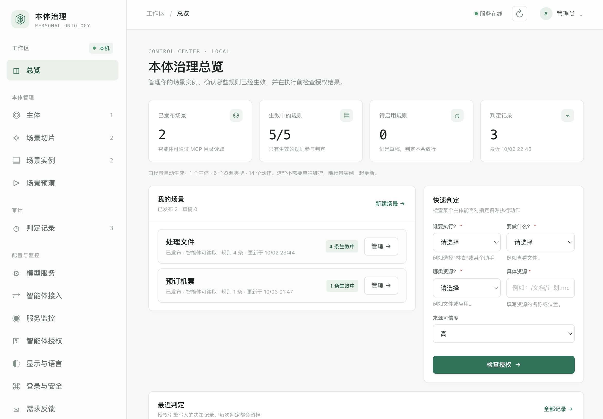

# 个人本体治理系统 v3.1

> 全栈中英双语界面、数据标签、后端消息、安装/使用手册、设计文档、
> 变更日志都必须有中英两版。详见 `docs/00-first-principle-bilingual.md`。
> English version: [`README.en.md`](README.en.md).



> 状态：v3.1 · 仅 macOS · 单用户本机运行 · 许可 GPL-3.0

**定位**：智能体想替你做事，必须先来问本机的判定引擎 —— 答案由你事先写好的规则决定，
引擎**只裁决、不代为执行**。
默认拒绝，拒绝优先于询问、询问优先于允许；规则、场景与判定记录整体加密保存在本机；
智能体**默认只收到判定结论**（“可以 / 不行 / 先问你”），读取本体数据需单独授权；每次判定都留档。

本项目包含 FastAPI 本地 API、RDF/Turtle 持久化、SHACL 校验、授权判定和原生 HTML/CSS/JavaScript 管理界面。服务默认只监听 `127.0.0.1`，所有 `/v1` 路由都要求 Bearer Token。

## 一键安装

macOS 在项目目录运行：

```bash
bash ./install.sh
```

### 场景切片模型配置

打开「配置与监控 → 模型服务」，填写 OpenAI 兼容服务地址、模型名称和可选 API Key，保存后使用“测试连接”检查配置。支持云服务和本机部署的兼容接口。旧版本通过 `SCENARIO_LLM_BASE_URL`、`SCENARIO_LLM_MODEL`、`SCENARIO_LLM_API_KEY` 配置的服务会在升级时迁移到加密配置。

模型配置（服务地址、模型名称与 API Key）与本体数据一并保存在本机加密容器 `data/ontology.po.json` 的 `model_service` 区段中；API Key 在该区段内另用本机密钥再加密一层，解密密钥由登录口令派生、不落盘。旧版本的 `data/model-service.json` 与 `data/model-service.key` 仅作为兼容回退保留（只有容器区段不可用时才读写），不会自动删除。
场景描述及资源/动作目录会发送给所配置的模型服务；主体和授权数据不会随请求发送。测试连接会发送一条简短请求，服务商可能按其计费规则计费。

默认安装至 `~/personal-ontology`，可用 `PERSONAL_ONTOLOGY_HOME=/自定义路径` 覆盖。脚本建立 Python 虚拟环境、安装依赖，并安装 macOS LaunchAgent，使服务在用户登录后自动启动。Python 需为 3.11 或更新版本。登录凭据由你在首次打开控制台时自行设置（见下）。

```bash
~/personal-ontology/stop.sh
~/personal-ontology/start.sh
~/personal-ontology/status.sh
```

`status.sh` 调用两个公开的健康检查端点，无需凭据。

本机运行**两个回环端口**，都是必要分工：

| 端口 | 进程 | 职责 |
|---|---|---|
| `127.0.0.1:8765` | 本机控制台 / 服务管理器 | 提供控制台页面与前端静态文件、进程与日志管理端点（`/manager/*`），并把 `/v1/*` **反向代理**到治理后端。**始终运行。** |
| `127.0.0.1:8766` | 治理后端（本体数据 + 授权判定引擎） | 提供 `/v1/*` 数据与判定 API。由管理器按需**启动、停止与重启**。 |

之所以分成两个，是为了让后端出问题时可自救：后端崩溃或配置写坏时，管理器仍在运行，页面依然打得开，可以从「配置与监控 → 服务监控」重启后端并查看 `data/server.log`。若合并成一个进程，重启后端就会连带杀掉你正在用来修复它的那个页面。浏览器只需访问 8765，8766 不必直接暴露。

首次打开 http://127.0.0.1:8765 会要求你**设置登录密码**（至少 8 位、含 3 类字符）。这个密码同时用于登录和派生加密密钥：本体数据整体存放在加密容器 `data/ontology.po.json` 中，登录即解锁，空闲超时或手动锁定后内存中的密钥与数据立即丢弃。**忘记密码将无法恢复数据。**

「配置与监控 → 服务监控」展示管理器、治理后端/判定引擎、前端文件、本体与 SHACL 文件、RDF 存储、模型配置及当前 MCP 客户端会话。后端停止时，管理器仍保持运行，页面可启动或重启后端并查看 `data/server.log`。`stop.sh` 只停止治理后端，`start.sh` 同时启动管理器和后端。

「配置与监控 → 智能体接入」提供 WorkBuddy 和 Meta Muse Code 的 MCP stdio 配置示例，复制到相应客户端后由客户端启动本机 MCP 子进程。工具提供治理目录读取（主体目录默认关闭）、授权检查、场景预演和场景反馈记录。智能体应先核对实例的运行时必填项与偏好；缺少信息时先询问用户。一次性输入只留在本次执行记录；只有用户明确确认长期适用的偏好才写回实例。实例更新记录包含用户原话、字段前后值、执行 ID、时间及实例版本。授权检查只产生判定和审计记录，不执行实际操作。消费版 Meta Muse 与 Meta Muse Code 的连接方式不同；不要把 Muse Code 的 MCP 配置粘贴到消费版 Muse。MCP 子进程退出后不再显示为在线会话。

场景偏好可设为“所有情况共用”或“按上下文维度区分”。全局模式不显示分组维度；分组模式可组合多个维度（例如城市 + 出行类型），并维护多个分组，每组有独立偏好。字段代码和显示名称由模型/系统固定，用户只改值；维度行的值用于匹配分组，其他行作为该组约束。每次执行必须收集的信息仍单独保存在 `required_inputs`，分组维度自动加入必填项。场景切片确认页和场景实例编辑页使用同一套结构；场景预演会按请求中的维度值精确匹配分组，找不到时返回“此实例不适用”，不会套用其他分组。MCP 目录提供 segmentation 结构；智能体反馈长期偏好时，分组场景须指定 `variant_id`，每次修订仍记录用户确认原话及前后值。

本体数据（含全部场景、规则与判定记录）整体存放在加密容器 `~/personal-ontology/data/ontology.po.json`，服务日志位于 `data/server.log`。**备份只需要这一个容器文件**；密钥由登录口令派生、不落盘，因此**忘记口令即无法恢复**，请把口令存进密码管理器。

服务仅监听回环地址（`127.0.0.1`），**不应直接暴露在公网或局域网**。MCP 使用 stdio 传输，由智能体客户端在本机启动子进程，不开放网络 MCP 端口。

**跨机使用**：MCP stdio 无法跨机（客户端只能启动本机进程），当前架构没有可供远程智能体访问的网络入口。若确需让另一台机器上的智能体使用本体，请走 SSH 隧道等加密通道，并保持本机服务只监听回环地址——不要为了让远程访问而把 `PERSONAL_ONTOLOGY_HOST` 改成 `0.0.0.0`：那样等于把整个本体（读 + 判定）暴露给同网段任何人，而这些接口只有本机会话令牌一道防线，没有 TLS、没有按智能体分发的凭据。

## 界面导航

侧边栏分四组：**工作区**、**本体管理**、**审计**、**配置与监控**。带数字的菜单项显示该目录当前的条目数。

### 工作区

**总览** —— 一眼看清现状。四张卡片是已发布场景、生效中的规则、待启用规则、判定记录；下面的「我的场景」按场景列出状态与规则条数；右侧「快速判定」可以直接问一个问题：某个主体能不能对某个资源执行某个动作 —— 用来在不实际执行的情况下确认规则是否按预期生效；最下面是最近的判定记录。

### 本体管理

**主体** —— 谁在做事。人员、智能体助手与服务的登记，以及它们之间的父子关系。场景分析会按需生成主体。

**场景切片** —— 用一句话描述你想做什么。模型抽取资源、动作、参数与条件，列出还需补充的信息，由你确认后保存为场景。分析面板会显示模型对每个字段的分档判断（每次必填 / 长期偏好 / 两者兼有）与判断理由，你可以在**偏好清单 ↔ 每次必填清单**之间直接改档。

**场景实例** —— 已发布场景的运行数据。每次执行都必须收集的信息单独保存在必填项里；长期偏好可以设为“所有情况共用”，也可以按上下文维度分组（例如“城市 + 出行类型”），每组维护自己的偏好。字段名与显示名只读，你只改值。

**场景预演** —— 用一组运行时输入推演“如果现在执行会怎样”。引擎按维度值精确匹配到一个分组，只检查全局偏好与该分组的偏好，返回判定结论。**预演不产生副作用，也不写入判定记录**；缺少维度值时会要求你补充，找不到匹配分组时返回“此实例不适用”，不会套用其他分组。

### 审计

**判定记录** —— 授权引擎写下的每一次判定，包含当时使用的规则引用与快照。之后修改规则不会抹掉历史依据，每条记录都可用执行 ID 回溯。

### 配置与监控

这一组标题下面是**七个独立页面**：

| 页面 | 用途 |
|---|---|
| **模型服务** | 配置 OpenAI 兼容的模型服务地址、模型名与 API Key（加密保存于本机容器），并可“测试连接”。**未配置模型时，场景分析会返回明确错误，不会伪造结果。** |
| **智能体接入** | 选择智能体（如 WorkBuddy、Meta Muse Code）并复制 MCP stdio 配置，粘贴到客户端后由客户端在本机启动 MCP 子进程。页内同时说明数据访问范围、名称显示方式与跨机接入。 |
| **服务监控** | 展示管理器、治理后端、前端文件、本体与 SHACL 文件、RDF 存储、模型配置与当前 MCP 会话的状态。后端停止时，可以在这里启动或重启它并查看日志。 |
| **智能体授权** | 逐个程序、逐项能力授权，分“等待你批准 / 已授权 / 已拒绝”三区。从未申请过的程序不会静默放行，会出现在待批准区。 |
| **显示与语言** | 中文 / 英文界面切换。 |
| **登录与安全** | 修改登录口令，以及设置空闲自动锁定的时长（默认 30 分钟，可选不自动锁定）。口令同时用于登录与派生加密密钥，因此修改口令会重新加密容器。 |
| **需求反馈** | 提交意见与问题的入口。 |

## API

健康检查无需令牌：

```bash
curl http://127.0.0.1:8765/health
```

其余端点都需要登录后拿到的会话令牌 `Authorization: Bearer <token>`。先用登录密码换取令牌：

```bash
TOKEN="$(curl -s -H 'Content-Type: application/json' \
  -d '{"password":"你的登录密码"}' \
  http://127.0.0.1:8765/v1/login | python3 -c 'import json,sys; print(json.load(sys.stdin)["token"])')"

curl -H "Authorization: Bearer $TOKEN" \
  -H 'Content-Type: application/json' \
  -d '{"principal_id":"alice","principal_type":"person","display_name_zh":"Alice"}' \
  http://127.0.0.1:8765/v1/principals
```

未初始化时所有 `/v1/*` 返回 409 `ontology_uninitialized`；未登录或已锁定返回 401 `login_required`。
解锁期间控制台会写一个临时的 `data/session-token`（权限 0600）供本机 MCP 子进程读取，锁定后立即删除。

通用 CRUD 路由为 `GET/POST /v1/{collection}`、`GET/PATCH/DELETE /v1/{collection}/{id}`。可用集合由 `GET /v1/collections` 返回。提交的数据在写入前通过 `ontology/shapes.ttl` 校验；校验错误返回 HTTP 422 与 SHACL 报告。删除被引用的节点会返回冲突。

判定端点：`POST /v1/decisions/evaluate`，请求含 `principal_id`、`action_id`、`resource_type_id`、`resource_id`，可选 `context`、`phase`。每次判定会写入审计记录；无法写入 allow 审计记录时不会返回可执行 allow。

## 本体程序和业务的安全性设计

### 数据落盘：一个加密容器

- 本体数据（场景、规则、判定记录）与模型服务配置整体存放于**单个加密容器** `data/ontology.po.json`；磁盘上没有明文 RDF 或 JSON 本体。
- 密钥派生 **PBKDF2-HMAC-SHA256，2,000,000 次迭代**；对称加密 **AES-256-GCM**。
- `ontology` 与 `model_service` 两个区段各自**独立盐与 nonce**，并绑定 AAD —— 密文被挪用、跨区段拼接或篡改会直接解密失败。
- 写入使用临时文件 + 原子替换；容器权限 `0600`，数据目录 `0700`。
- **敏感字段都在容器内**：API Key 在 `model_service` 区段里另用本机密钥再加密一层；联系方式作为图记录一并加密。解密密钥由登录口令派生，**不落盘**。

### 凭据与会话

- 登录口令至少 8 位、包含小写/大写/数字/符号中至少三类，并比对 **10,004 条常见口令黑名单**；比对前做归一化（转小写、去掉结尾数字与符号），因此 `Password123!` 这类口令同样被拒。
- **会话令牌只存在于后端进程内存**，不写磁盘；所有 `/v1` 路由都要求 Bearer 令牌。
- 空闲自动锁定可配置（默认 30 分钟，也可选择不自动锁定）；锁定即丢弃内存中的密钥与图数据。

### 网络与接入面

- 管理器与治理后端都**只监听回环地址** `127.0.0.1`；浏览器请求做同源校验，跨源请求返回 `403`。
- 智能体接入走 **MCP stdio**：由客户端在本机启动子进程，**不开放网络 MCP 端口**。
- 智能体身份由 Unix 域套接字的**对端进程凭据**（PID / UID / 可执行路径 / 命令行）判定，因此**不存在可被拷走复用的令牌文件**；每个能力项单独授权，从未申请过的程序会停在「等待你批准」。
- **不要把监听地址改成 `0.0.0.0`**：那等于把整个本体连同判定权限交给同网段的任何人。

### 判定引擎

- **默认拒绝**：没有匹配到规则就不放行；未知操作符、未注册的约束同样不放行。
- `draft`（草稿）与 `suspended`（暂停）状态的规则**永不参与放行**；正则类匹配器默认禁用。
- 拒绝优先于询问，询问优先于允许。
- 授权检查**只产生判定与审计记录，不执行任何实际操作**；真实操作应由调用方在单独、明确的执行流程中完成。

### 审计与业务侧价值

- 每次判定都留档，记录**执行时的规则引用与快照** —— 之后修改规则不会抹掉历史依据。
- 场景实例的更新记录保留**用户原话、字段前后值、执行 ID、时间与实例版本**。
- 于是「谁授权了什么、依据是什么、什么时候执行」都有结构化证据：对个人是可回溯的授权记录，对集成方是把责任界面画清楚，而不是依赖一份没人看的服务条款。
- 数据默认不出本机；**配置远端模型后，场景描述与资源/动作目录会发送给该服务**（主体与授权数据不随请求发送）。使用本地模型则不出设备。

### 怎么自己验证

一条命令跑完全部检查（只读，不需要登录口令）：

```bash
bash ~/personal-ontology/scripts/verify-security.sh
```

逐条命令与预期结果见 [`docs/10-security-verification.md`](docs/10-security-verification.md)。

### 明确不防的范围

- **解锁期间明文在内存里**：能读取后端进程内存的程序已在本模型之外；上面的加密保护的是**落盘**数据。
- **它不是沙箱**：判定引擎只做授权裁决，不拦截智能体的实际操作；代理必须主动调用并遵守结果。
- **没有 TLS**：设计前提是本机回环，请不要跨网络暴露。
- **弱口令仍是最大风险**：2,000,000 次迭代抬高离线爆破成本，但不等于不可破；口令请存进密码管理器。
- 单用户、仅 macOS；多进程写入协调、用户身份集成、外部执行器与通知发送需由部署方接入。

## 文档与测试索引

**设计文档**

| 文档 | 内容 |
|---|---|
| `docs/00-first-principle-bilingual.md` | 全栈双语第一性原则：分层要求、约定、检查、例外 |
| `docs/03-scenario-slices-design.md` | 场景切片与元模型设计（**设计稿**，文首有现状更正） |
| `docs/04-design-vs-implementation-gaps.md` | 历史差距快照（仅供追溯） |
| `docs/05-secret-and-sensitive-data-design.md` | 加密容器格式与密钥派生（**冻结**，含测试向量） |
| `docs/06-remote-agent.md` | 远程智能体接入 |
| `docs/07-local-agent-access.md` | 本机智能体访问（Unix 套接字 + 授权清单） |
| `docs/08-ios-app-plan.md` | iOS 方案评估（**结论：暂不实施**，含三条理由） |
| `docs/09-scenario-analysis-schema.md` | **场景分析数据结构契约**（三档分类、策略、兼容性、模型陷阱） |
| `schemas/scenario-analysis.schema.json` | 上述契约的 JSON Schema（供程序校验与其它实现对齐） |

**自检**（全部为可直接运行的脚本，无需 pytest）

```
~/personal-ontology/.venv/bin/python tests/test_vault.py                # 加密容器与格式向量
~/personal-ontology/.venv/bin/python tests/test_api_auth.py             # 会话与鉴权
~/personal-ontology/.venv/bin/python tests/test_temporal.py             # 时间条件
~/personal-ontology/.venv/bin/python tests/test_agent_access.py         # 本机智能体授权
~/personal-ontology/.venv/bin/python tests/test_mcp_e2e.py              # MCP 端到端
~/personal-ontology/.venv/bin/python tests/test_policy_actions.py       # 策略按动作限定
~/personal-ontology/.venv/bin/python tests/test_multi_resource.py       # 多资源类型
~/personal-ontology/.venv/bin/python tests/test_both_tier.py            # 字段三档（两者兼有）
~/personal-ontology/.venv/bin/python tests/test_analysis_contract.py    # 分析契约校验
~/personal-ontology/.venv/bin/python tests/test_hotel_fallback.py       # 酒店兜底路径
~/personal-ontology/.venv/bin/python tests/test_label_localization.py   # 标签按显示语言本地化
~/personal-ontology/.venv/bin/python tests/test_messages_bilingual.py   # 后端消息目录
~/personal-ontology/.venv/bin/python tests/test_bilingual_coverage.py   # 全栈双语覆盖盘点
~/personal-ontology/.venv/bin/python tests/test_i18n_coverage.py        # 界面文案覆盖
~/personal-ontology/.venv/bin/python tests/test_i18n_text.py            # 文本替换逻辑
~/personal-ontology/.venv/bin/python tests/test_i18n_rules.py           # 插值串规则
~/personal-ontology/.venv/bin/python tests/test_ui_consistency.py       # 界面一致性（导航↔路由↔渲染）
```

**运维脚本**

```
scripts/verify-deploy.sh     # 校验已安装副本与工作区源码是否逐文件一致（部署后必跑）
```

## 许可证

本项目采用 **GNU 通用公共许可证第 3 版（GPL-3.0）**，全文见 [`LICENSE`](LICENSE)。

- **你可以**：自由使用、修改、再分发（包括商业用途）。
- **你必须**：再分发时（包括你修改过的版本）保留版权与许可声明，并以同样的 GPL-3.0 许可开源。
- **不提供担保**：作者不对本软件作任何担保。

需要完整条款时，请阅读 [`LICENSE`](LICENSE) 全文。

---
