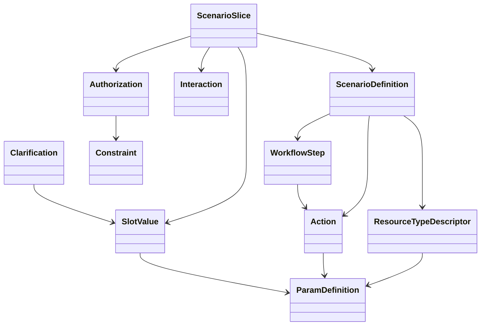
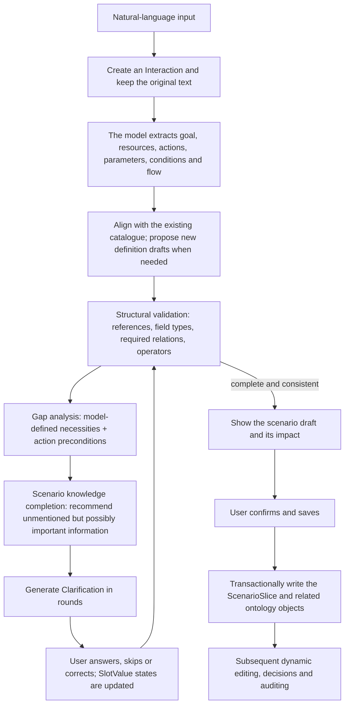
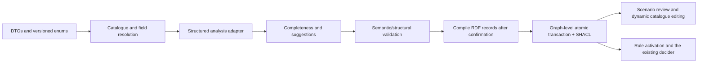

     this marker keeps the document counted as an open bilingual gap (see tests/test_bilingual_coverage.py). -->
# Scenario slices and a generic scenario metamodel design

> **Status correction (2026-10-02)** — this is a design draft, and two things in it disagree with the
> current implementation. This box prevails:
>
> 1. **The three catalogue pages (resource types / actions / authorization rules) have been removed**
>    (every later instruction to "keep the … pages / catalogue pages" is void). The judgement at the
>    time was that the management-style pages for "create and edit catalogue entries" were obsolete —
>    resource types and actions should come out of **scenario analysis** rather than being maintained
>    by hand.
>    The cost was that this data was briefly invisible in the interface, which caused confusion such
>    as "I cannot see the resource types" and "why is this rule not taking effect". The current
>    visibility approach: the **analysis panel on the scenario-slice page** shows the model's field
>    classification and its reasons, and the scenario-instance page lets you reclassify directly
>    between the **preference list** and the **required-per-run list** (see docs/09 §2).
> 2. **This iteration added three capabilities to the metamodel** (see
>    `docs/09-scenario-analysis-schema.md`):
>    - **Three field tiers**: `required` (per run) / `preference` (standing) / `both` (both)
>    - **Policies scoped per action**: `policies[].actions`, so "allow viewing, deny deleting" can be
>      expressed correctly
>    - **A scenario may have several resource types** (for example "file" and "directory")
>
> The contract, backward-compatibility rules and known model pitfalls are defined by `docs/09`.

Status: design draft, not yet implemented.

## 1. Goals and boundaries

Scenario slices give ordinary users a natural-language entry point, turning "what I want to do" into
ontology data that can be checked, supplemented, confirmed, and then edited further in the existing
management pages. New scenarios should be expressed through metadata; each scenario must not require
changes to backend classes, frontend pages or fixed fields.

This design preserves the existing objects and the direction of API compatibility; the new scenario
objects connect the existing resource, action, authorization, interaction, decision and audit
objects. A large language model may extract and suggest, but it must not pass unconfirmed inferences
off as user requirements, nor bypass ontology validation to write directly to storage.

## 2. Inventory of existing objects and how they are handled

Every object currently defined in `backend/model.py` is retained, layered by responsibility as
follows.

| Responsibility | Current objects | Design treatment |
|---|---|---|
| Identity | Principal | Retained; principals and their parent/child relations remain authorization objects. |
| Resource and action catalogue | ResourceTypeDescriptor, ParamDefinition, Action, Matcher | Retained with enhanced field definitions; parameter definitions are upgraded into self-describing generic field definitions, compatible with the existing `ParamDefinition`. |
| Authorization and security | Authorization, Constraint, Redline, DecisionResult | Retained; Constraint is extended into a typed, executable condition expression; denial redlines and decision results stay separate. |
| Interaction and runtime | Interaction, Context, Decision, Execution, Evidence | Retained; scenario interaction links an Interaction, actual authorization goes through Decision, actual operations are recorded in Execution, and evidence is still referenced by Evidence. |
| Classification vocabularies | Taxonomy, TaxonomyItem | Retained; used for extensible classifications and options, not responsible for a whole scenario schema. |
| Notification and platform capabilities | ContactPoint, Notifier, CryptoProvider, Trigger, Notification | Retained; not forced into the core scenario model, but a scenario flow may reference them as needed. |

No existing RDF class is deleted or renamed by this design. Database migration must keep historical
URIs, existing API fields and audit records readable.

## 3. The generic metamodel

### 3.1 Structure



### 3.2 Conceptual responsibilities

| New concept | Description |
|---|---|
| ScenarioDefinition | A reusable task structure: goal description, resource types, actions, field definitions, optional flow and checking hints. Stored as data; it must not be hotel-specific code. |
| ScenarioSlice | One actual task by a user: the original description, goal, confirmed values, missing items, suggestions, status and model version. The user may separately turn it into a private reusable definition; by default a single request is not promoted into a global template automatically. |
| WorkflowStep | An optional action sequence, preconditions, success/failure branches and whether user confirmation is required. |
| ParamDefinition (extended) | A generic field definition applying to resource attributes, action inputs/outputs, user preferences and context. The existing class name and old fields are kept, with added metadata such as `scope`, `value_schema`, `unit`, `examples`, `sensitivity`, `collection_policy` and `applies_to_ids`. Actions declare input and output fields through `hasInputParam` / `hasOutputParam` respectively. |
| SlotValue | The value and state of one field in a scenario instance. States include at least `unknown`, `suggested`, `asked`, `confirmed`, `rejected`, `not_applicable`. Records the provenance (user, model, system), confidence, update time and confirmer. |
| Clarification | A question generated for a missing required item or a model suggestion, storing the question, reason, related field, required/recommended level and answer state. Question text may be generated dynamically; every phrasing does not need its own class. |
| Constraint (extended) | Keeps the existing object and expresses typed boolean conditions; at minimum it holds a field path, an operator, a typed value and a unit. The executor accepts only registered, safe operators. |
| Authorization (extended) | Keeps the principal, resource, action, effect and condition relations, and adds a policy lifecycle state so a generated draft does not immediately take part in decisions. |

`ScenarioDefinition` may reference existing ResourceTypeDescriptor, Action, ParamDefinition,
WorkflowStep and optional checking hints; domain vocabulary it has not seen before can become new
definition data. The structure must pass generic schema validation; the model may not add arbitrary
code or arbitrary executable predicates.

### 3.3 Field definitions and conditions

Field definitions must support common data types: text, number, money, boolean, enum, date, date
range, duration, location, object reference and list. Type definitions may carry a unit, format,
bounds, option source, display name, description and examples.

`collection_policy` expresses how information is obtained, for example:

- `required`: must be obtained before performing the action;
- `recommended`: common in this scenario, worth asking but skippable;
- `optional`: collected only when the user chooses to care about it;
- `derived`: can be safely computed from other confirmed data;
- `not_collected`: explicitly unused by this scenario.

User-entered conditions and preferences must be distinguished: when a hard constraint is not
satisfied the candidate is excluded; a preference is used for ordering or hints and must never be
silently promoted into a hard limit. A money field must store its currency and pricing basis (for
example per night or for the whole stay), and dates and durations must not overwrite each other.

The initial Constraint operators should be a fixed allowlist, such as `eq`, `neq`, `lt`, `lte`, `gt`,
`gte`, `in`, `contains`, `between`, `before`, `after`, `exists`. Types, units and field provenance
must be validated before comparison; when a condition cannot be executed or units are incompatible,
the rule must not produce allow.

## 4. Information completeness and proactive suggestions

Completeness checking has two separate sources, clearly distinguished in the interface:

1. **Model-defined necessities**: an action's required inputs, a workflow's preconditions, or
   information the scenario definition marks as required. Missing items block entry into an
   executable preview and generate an explicit follow-up question.
2. **Model scenario suggestions**: using the natural language, generic scenario definitions and model
   knowledge, propose items that may help but that the user did not mention. Each carries a reason,
   impact and suggested priority, and the user may adopt, modify, skip or mark it not applicable.

Suggestion checking can proceed in rounds: resolve the necessary information for identity, goal and
actions first, then ask about high-impact conditions that change the candidate set, and finally show
lower-priority preferences. Each round limits the number of questions so a knowledge checklist is not
dumped on the user all at once.

A model suggestion is neither a fact nor a default preference. It must be stored in `suggested` state
and only becomes a scenario constraint or preference once the user explicitly accepts it. If the model
is unsure whether an attribute is relevant it should ask "do we need to consider …" and explain why.

## 5. Worked example: hotel booking

User input: "When booking a hotel, ask for my destination city, price no more than 500, and I also care
about location, reviews, whether there is parking, floor, smoking, dates, and how many days."

| Content | Mapping | State / follow-up |
|---|---|---|
| Book a hotel | Resource type hotel; action book. Search and compare actions may be suggested. | The book action is already present, so it is not reported missing; search/compare are system suggestions. |
| Destination city | The location parameter of the hotel search/booking action | The user explicitly requires asking; no city value exists yet, so a follow-up is required. |
| Price no more than 500 | An upper-bound price condition | Ask about currency, per night or whole stay, and whether taxes are included; the machine condition can only be generated after confirmation. |
| Location, reviews | Hotel filter attributes / preferences | The user expressed interest but gave no area or rating threshold; may ask whether to set a specific requirement. |
| Parking available | A hotel facility attribute | Suggest asking whether it is a hard requirement or merely preferred. |
| Floor, smoking | Room preference attributes | Ask for the required floor range and non-smoking requirement; skipping is allowed. |
| Dates, how many days | Check-in date and length-of-stay parameters | Ask for the check-in date and the number of nights; dates and day counts get separate fields with a consistency check. |
| Whether the surroundings are noisy or the room faces the street | Hotel-scenario suggestions added by the model | Explicitly marked as system suggestions, asked whether to include, with no preset value. |
| Submit the booking | A workflow step | Before booking, show the hotel, price, dates and terms and require user confirmation; entering natural language is not itself confirmation of the order. |

The hotel is only one data record of a `ScenarioDefinition`. Location, reviews, parking, noise and so
on are all extensible field definitions, and the generic editor generates controls from field
metadata without writing page code per attribute.

## 6. Data flow and joint validation



Responsibility boundaries:

- The model parses language and proposes candidate mappings and follow-up questions; its output must
  be a structured draft constrained by the schema.
- The ontology and SHACL validate structure: classes, relations, data types and cardinality.
- Scenario/action definitions determine required parameters and workflow conditions.
- The constraint executor checks the restricted operators; SHACL does not replace runtime numeric and
  date computation.
- The user confirms suggestions, resolves ambiguity, and authorizes any execution with external
  impact.

New resources, actions and rules should show their source and purpose in the preview together; one
confirmation writes transactionally and rolls back on failure, so a resource is never created while
its action or authorization relation is missed.

## 7. Page and menu design

Suggested top-level menu order: overview, principals, **scenario slices**, resource types, actions,
authorization rules, decision records.

### The scenario-slice page

1. Natural-language input area: examples, scenario goal, principal selection (the current principal
   may be the default; the user is not asked to type an id).
2. Dialogue follow-up area: required questions and system suggestions grouped separately; each
   suggestion offers "adopt / modify / skip / not applicable".
3. Draft preview: goal, resources, actions, information items, hard constraints, preferences, flow
   and confirmation points; each marked as user input, model inference or awaiting confirmation.
4. Conflict and risk area: when units are unclear, conditions conflict, an action is unregistered, a
   rule is too broad or an external operation is unconfirmed, explain the impact and block any
   submission whose safety is unclear.
5. Post-save detail: show the relations among resources, actions, authorization rules and parameters,
   with links to continue editing in the existing menus.

### The catalogue editing pages

(**Void**, see the status correction at the top) ~~Keep the resource type, action and authorization
rule pages, but drive their forms from the metamodel's field definitions.~~ Adding a type or action
would then need no page code; related objects are chosen by display name; field descriptions,
examples, units and validation all come from metadata. Advanced configuration may be collapsed, and
internal ids and system state are not ordinary user input.

## 8. Validation and security principles

- Explicit user input, model suggestions, model inferences and system defaults must carry different
  provenance markers.
- An unconfirmed model suggestion must not create a hard constraint or widen authorization.
- A newly created authorization rule defaults to draft; saving a scenario, enabling a rule and
  placing an order with an external service are three different actions, and one natural-language
  sentence must not merge their authorization automatically.
- A user's description cannot serve as the final confirmation for an external operation; high-impact
  actions get an explicit confirmation step.
- Dynamic definitions may declare only data fields and registered operators/workflow nodes, never
  arbitrary code, queries or executor entry points.
- Field sensitivity, retention periods and log redaction must follow field/slot metadata design; the
  original natural language and scenario values are stored under the privacy policy.
- An unknown field, unknown operator, unit mismatch, broken reference or validation timeout must never
  lead to allow.

## 9. Phased design and implementation order

1. **Finalise the model**: settle the attributes and relations of ScenarioDefinition/ScenarioSlice,
   generic fields, SlotValue, Clarification, WorkflowStep and Constraint.
2. **Compatibility mapping**: map the existing 21 classes one by one onto the new layering; define
   defaults and migration rules for old data without deleting old URIs.
3. **Validation contract**: determine the dynamic field schema, the SHACL structural rules, semantic
   validation and the allowlisted constraint operators.
4. **Hotel example validation**: verify that required follow-ups, recommended completion, price units,
   length of stay and the confirmation flow all land in the generic structures.
5. **Cross-scenario validation**: validate with a scenario from another domain that no new class or
   page code is needed, and only then start implementing.

This file is a design baseline; it does not mean the new object names and final RDF property URIs are
frozen. Before implementation, the class/property list, cardinalities, versions and the API JSON
contract must be reviewed item by item.

## 10. Class and property contract (review version)

The cardinalities below describe the persisted objects after confirmation; during analysis fields may
be missing, explicitly recorded through `SlotValue` and `Clarification`. All objects use
system-generated ids; display names serve the user interface and ids are used only for relation
references.

### 10.1 ScenarioDefinition

| Property | Type / cardinality | Notes |
|---|---|---|
| `scenario_definition_id` | string, 1 | System-generated stable identifier. |
| `display_name_zh` / `display_name_en` / `description_zh` / `description_en` | string, 1 / 0..1 / 0..1 / 0..1 | Reuses the project's bilingual label fields; the Chinese name is required, the rest optional. |
| `version` | string, 1 | Data-definition version, for migration and reproduction. |
| `resource_type_ids` | ResourceTypeDescriptor, 0..* | Resource types the scenario handles. |
| `action_ids` | Action, 0..* | Actions the scenario may involve. |
| `param_definition_ids` | ParamDefinition, 0..* | Scenario fields and inquiry definitions. |
| `workflow_step_ids` | WorkflowStep, 0..* | Optional workflow templates, ordered by `sequence`. |
| `completeness_hints` | JSON, 0..* | Optional hints for scenario completion suggestions; must carry source and version and cannot act as mandatory rules or authorization. |
| `lifecycle_state` | enum, 1 | draft/active/deprecated; after deprecation historical instances remain readable. |

A scenario definition need not exist beforehand. The model may create one as a draft after user
confirmation; it can be reviewed again before reuse or sharing. An unknown domain must not block a
scenario-instance draft.

### 10.2 ScenarioSlice

| Property | Type / cardinality | Notes |
|---|---|---|
| `scenario_slice_id` | string, 1 | System-generated identifier. |
| `scenario_definition_id` | ScenarioDefinition, 0..1 | References an existing definition when matched; otherwise it may temporarily have none. |
| `owner_principal_id` | Principal, 0..1 | Recorded once the current user is resolved; no identity is invented before that. |
| `original_input` | string, 1 | The user's original text, never overwritten by model rewriting. |
| `normalized_goal` | string, 0..1 | A goal summary confirmed by the user or explicitly marked as model-drafted. |
| `status` | enum, 1 | draft/clarifying/ready/confirmed/active/completed/abandoned; confirmed/active are the scenario lifecycle and do not mean the authorization policy is enabled. |
| `slot_value_ids` | SlotValue, 0..* | The known, missing, suggested and rejected items of this scenario. |
| `clarification_ids` | Clarification, 0..* | The inquiry records. |
| `interaction_ids` | Interaction, 0..* | Links to the interaction records the system already has. |
| `authorization_ids` | Authorization, 0..* | Rules created or selected after user confirmation. |
| `revision` | integer, 1 | Incremented on every change, so drafts and the confirmed version can be compared. |
| `created_at` / `updated_at` | dateTime, 1 / 1 | System-managed times. |

### 10.3 ParamDefinition and SlotValue

**ParamDefinition (compatible with the existing class)** keeps `param_name`, `param_type`, the
Chinese and English display names and `required`, and adds:

| Property | Cardinality | Notes |
|---|---:|---|
| `scope` | 1 | resource_attribute/action_input/action_output/context/preference. |
| `applies_to_ids` | 0..* | Applicable resource types or actions. |
| `value_schema` | 1 | Typed definition; the type may be string/number/boolean/enum/date/date_range/duration/money/location/reference/list/object. |
| `unit` | 0..1 | The numeric unit or the currency semantics of an amount, for example CNY; a unit must never be inferred from a bare number. |
| `collection_policy` | 1 | required/recommended/optional/derived/not_collected. |
| `examples` | 0..* | Example values to help the user understand. |
| `sensitivity` | 1 | public/personal/sensitive; affects display, logging and retention. |
| `validation_schema` | 0..1 | Data constraints such as ranges, enums and formats; executing code is not allowed. |
| `display_order` | 0..1 | Ordering in the dynamic form. |

`SlotValue` contains at least `slot_value_id`, `scenario_slice_id`, `param_definition_id`, `value`
(JSON), `state`, `provenance`, `confidence` (nullable), `source_text` (an optional reference or
fragment), `confirmed_by` (nullable) and timestamps. `provenance` is one of
user_explicit/user_confirmed/model_inferred/system_derived. An inferred value must not masquerade as
user_explicit, and an important condition must not be auto-confirmed on confidence alone.

### 10.4 Clarification, WorkflowStep and Constraint

| Class | Required properties | Notes |
|---|---|---|
| Clarification | ID, slice, related field or missing item, question, reason, priority, requirement_level, status | `requirement_level` is blocking/recommended/optional; status is open/answered/skipped/not_applicable. The answer is written into the corresponding SlotValue and the original question and answer are kept. |
| WorkflowStep | ID, owning definition, sequence, action reference or generic step type, input mapping, preconditions, confirmation_policy | `confirmation_policy` supports at least never/when_high_impact/always; an irreversible external operation must have explicit user confirmation. |
| Constraint | ID, subject/path, operator, typed value, unit, hard_or_preference, source | Reuses the existing Constraint class and its Authorization relation, while mapping the old `constraint_type`/`constraint_value` onto a typed expression; an unknown operator or an incompatible unit invalidates the constraint and cannot allow. |
| Authorization lifecycle | `policy_status`: draft/active/suspended, default draft | A draft rule can be edited further in the menus; only an active rule the user explicitly enabled takes part in decisions. Suspension is not revocation — the existing `revoked` field keeps its revocation semantics. |

Recommended questions in a scenario slice may be generated by the model on the fly and need not all
be pre-written as Clarification templates; once persisted, every question still uses the same
Clarification structure.

## 11. Draft generic API contract

Analysis capability should be decoupled from a specific model vendor; the API returns a structured
draft plus validation and follow-up questions, and the frontend is not expected to assemble several
low-level CRUD requests itself.

### 11.1 Create or continue an analysis

`POST /v1/scenario-slices/analyze`

```json
{
  "scenario_slice_id": null,
  "user_input": "当预定酒店的时候，价格不超过500……",
  "principal_id": null,
  "answers": [],
  "locale": "zh-CN"
}
```

> The `user_input` above is an **example request payload**, i.e. user data, not interface text — see
> the exceptions in `docs/00-first-principle-bilingual.md`.

The response contains the `scenario_slice` draft, `recognized` (explicitly identified content),
`inferred` (unconfirmed inferences), `suggestions` (additional suggestions and their reasons),
`clarifications` (questions to answer), `validation` (structural problems) and `next_state`. To
continue an analysis, pass the slice id plus the new original text/answers for this round; the server
keeps the original rounds.

### 11.2 Save the confirmed version

`POST /v1/scenario-slices/{id}/confirm` accepts the user-confirmed slots, the suggestions adopted or
skipped, and the workflow options the user authorized. The server re-validates and then, in one
transaction, writes the ScenarioSlice, the necessary catalogue objects, the Authorization/Constraint
relations and the audit references. New rules default to draft; "confirming a scenario draft" does not
automatically mean "enabling an authorization policy" — activating rules requires a separate explicit
action in the preview or the rules menu. Idempotency keys and revision prevent duplicate submissions
and concurrent overwrites.

Read-only `GET /v1/scenario-slices/{id}`, list endpoints and a structural validation endpoint are also
provided. The existing generic CRUD remains available; the API schema for dynamic fields and values is
validated against ParamDefinition rather than adding a Pydantic class or dedicated endpoint per new
field.

If a scenario only adds definition drafts that the user has not confirmed, the saved scope and state
must be explicit; model-generated rules must never be silently enabled as active/allow.

## 12. Cross-scenario generality check: online shopping

Input: "Help me buy a laptop, budget within 8000 yuan, prefer thin and light with good reviews, not
second-hand; compare a few first, and let me confirm before paying."

| Extracted result | How the generic model carries it |
|---|---|
| Product, laptop | ResourceTypeDescriptor with dynamic attribute definitions. |
| Search, compare, order, pay | Action and WorkflowStep; action parameters described by ParamDefinition. |
| Total price no more than 8000 yuan | A money-typed SlotValue plus an `lte` Constraint, unit CNY, with the pricing basis explicitly the total price. |
| Prefer thin and light, good reviews | preference-type conditions, used to order candidates rather than to eliminate them. |
| Not second-hand | A hard condition on the product's condition; if a "second-hand" field is not in the catalogue, it becomes new attribute-definition data confirmed by the user, not a new code class. |
| Let me confirm before paying | The payment step's confirmation_policy=always. |
| Possibly missing information | The model may suggest asking about brand, size, purpose and delivery area/time; each carries a reason and the user may skip it. |

This scenario and the hotel scenario share ScenarioSlice, ParamDefinition, SlotValue, Clarification,
WorkflowStep, Constraint, Action and the resource catalogue, adding no new metamodel class or page
code. If both scenarios can be expressed and the existing principal, notification, encryption,
trigger, decision and evidence objects still have clear responsibilities, then the direction of "be
extensible without losing old capability" holds.

## 13. Decisions still to be finalised

1. Whether a scenario definition is user-private, shareable, or split into a personal and a system
   library; the default is private per user.
2. Whether ScenarioSlice relates to Interaction one-to-many, or whether Interaction is the scenario
   instance itself; this draft chooses a separate ScenarioSlice linked to one or more Interactions,
   preserving the existing Interaction semantics.
3. Where the natural-language model is deployed, how long original text is retained, and whether
   sensitive fields may be sent to a remote model; visible privacy options must be settled before
   implementation.
4. Which types and operators the dynamic condition executor supports first; an unimplemented operator
   must be explicitly marked unexecutable and must never degrade silently.
5. Whether a new ScenarioDefinition needs review before being shared; a model-generated definition
   defaults to draft and must not take effect for other users automatically.

## 14. Recommended default decisions

To keep the design discussion from stalling on open questions, the first version is recommended to
proceed with these defaults:

1. **Scenario definitions are private by default**: the current user can reuse them; sharing with
   other principals requires an explicit action. System-provided definitions are read-only and
   versioned.
2. **ScenarioSlice is independent of Interaction**: one scenario may span several dialogue rounds;
   each round is still recorded as an Interaction so it can be audited as-is and resumed.
3. **Model privacy defaults to local**: the project is currently positioned as a local service, so the
   first version does not send the user's original text to an unconfigured remote model. Before a user
   configures a remote model, the types of data sent must be disclosed; sensitive fields are redacted
   by default and the user may turn remote analysis off.
4. **A safe operator allowlist**: only implemented and verified operators are supported; an
   unsupported condition leaves the draft unenablable and is never turned into an unconditional
   allow.
5. **Three explicit confirmation points**: confirming parameters and suggestions, saving the scenario
   and rule drafts, and separately enabling authorization. A real external action such as booking
   still needs a further confirmation according to the WorkflowStep's confirmation policy.
6. **Fix the class names only after cross-scenario validation passes**: validate with the hotel and
   shopping scenarios first; only if both need nothing but new definition data, without dedicated code
   classes, may the RDF classes and property URIs such as ScenarioDefinition/ScenarioSlice be frozen.

---

## 15. Draft RDF class and property naming

The existing namespace `urn:personalontology:ontology#`, UpperCamelCase class names and
lowerCamelCase property names are kept. The URIs below are proposals; before they are finalised,
each must be checked for a clash with an existing property in the main ontology.

| Class | ID property | Main relations / properties |
|---|---|---|
| `ScenarioDefinition` | `scenarioDefinitionId` | `displayNameZh`, `displayNameEn`, `descriptionZh`, `descriptionEn`, `scenarioVersion`, `lifecycleState`, `hasResourceType`, `hasAction`, `hasParamDefinition`, `hasWorkflowStep`, `completenessHints`. |
| `ScenarioSlice` | `scenarioSliceId` | `usesScenarioDefinition`, `ownerPrincipal`, `originalInput`, `normalizedGoal`, `scenarioStatus`, `hasSlotValue`, `hasClarification`, `hasInteraction`, `hasAuthorization`, `revision`, `createdAt`, `updatedAt`. |
| `SlotValue` | `slotValueId` | `slotDefinition`, `slotValue` (`rdf:JSON`), `slotState`, `provenance`, `confidence`, `sourceText`, `confirmedBy`, `updatedAt`. |
| `Clarification` | `clarificationId` | `belongsToScenario`, `asksForParam`, `clarificationQuestion`, `clarificationReason`, `clarificationPriority`, `requirementLevel`, `clarificationStatus`, `answerSlotValue`. |
| `WorkflowStep` | `workflowStepId` | `stepOfScenario`, `stepSequence`, `invokesAction`, `stepType`, `inputMapping` (`rdf:JSON`), `precondition`, `confirmationPolicy`. |

The proposed extended `ParamDefinition` properties are: `paramScope`, `appliesToAction`,
`valueSchema` (a JSON Schema subset, `rdf:JSON`), `paramUnit`, `collectionPolicy`, `sensitivity`,
`paramExamples`, `validationSchema` (a restricted JSON subset) and `displayOrder`. The existing
`hasParam` keeps only the resource-type-to-field-definition relation; ScenarioDefinition uses a
separate `hasParamDefinition`, and Action uses `hasInputParam` / `hasOutputParam` to distinguish
inputs from outputs, avoiding several different domains on one OWL property.

`Constraint` keeps `constraintType` and `constraintValue` and adds `constraintPath`,
`constraintOperator`, `typedValue` (`rdf:JSON`), `constraintUnit`, `constraintMode`
(hard/preference) and `constraintSource`. `Authorization` gains `policyStatus`. `typedValue` and
`constraintValue` coexist for now: during migration both formats are read and written, and the old
field may be deprecated only after data and API compatibility is complete; the meaning of an old URI
must never be rewritten in place.

Existing generic id/time properties such as `createdAt` continue to be reused; state properties tied
to an object's semantics get their own names, so `po:status` no longer carries several mutually
different state vocabularies.

## 16. SHACL validation boundaries

SHACL covers RDF structure, property types, cardinality, enumerations and the class of referenced
objects; the details of dynamic field values are validated by the API against `valueSchema`; runtime
conditions are validated and evaluated by the constraint executor. A single SHACL shape must not
carry one dedicated field path per hotel parameter and per shopping parameter.

The main shape constraints:

| Shape | Key structural constraints |
|---|---|
| ScenarioDefinitionShape | exactly one ID/version/state; the name is required; every resource/action/parameter/step relation points at the right class. An enabled definition needs at least one action or an explicitly non-executing goal. |
| ScenarioSliceShape | ID/status/revision/original input required; definition and owner optional; slots, inquiries, Interaction and Authorization all need correct class references. `confirmed` must not contain an unresolved blocking clarification. |
| ParamDefinitionShape (extended) | field name, scope, type and collectionPolicy required; `valueSchema` is JSON; a parameter definition's input/output scope agrees with the related action. |
| SlotValueShape | exactly one scenario and one field definition; state and provenance within their enumerations; confidence in 0..1; a confirmed value must exist and pass the parameter schema. |
| ClarificationShape | must belong to one scenario; question, requirementLevel and status required; an answered item must reference an answer slot; a skipped item must not be treated as an existing value. |
| WorkflowStepShape | the owning definition and the step type are required; sequence is a non-negative integer unique within its definition; an action reference is optional but must exist if present; the confirmation policy is within its enumeration. |
| ConstraintShape (extended) | path, operator and mode required; the operator is a registered allowlist entry; the typed value is JSON; the compared value is compatible with the field schema/unit. Cross-node unit and operator checks that pure SHACL cannot do are the API/executor's responsibility. |
| AuthorizationShape (extended) | a new rule must have a policyStatus; only active rules enter decisions; draft/suspended can never produce allow. Legacy rules get a status backfilled per the compatibility rules. |

An illustrative shape (showing the direction, not final Turtle to be merged as-is):

```turtle
po:SlotValueShape a sh:NodeShape ; sh:targetClass po:SlotValue ;
  sh:property [ sh:path po:slotValueId ; sh:minCount 1 ; sh:maxCount 1 ; sh:datatype xsd:string ] ;
  sh:property [ sh:path po:slotDefinition ; sh:minCount 1 ; sh:maxCount 1 ; sh:class po:ParamDefinition ] ;
  sh:property [ sh:path po:slotValue ; sh:maxCount 1 ; sh:datatype rdf:JSON ] ;
  sh:property [ sh:path po:slotState ; sh:minCount 1 ; sh:in ("unknown"^^xsd:string "suggested"^^xsd:string "asked"^^xsd:string "confirmed"^^xsd:string "rejected"^^xsd:string "not_applicable"^^xsd:string) ] ;
  sh:property [ sh:path po:provenance ; sh:minCount 1 ; sh:in ("user_explicit"^^xsd:string "user_confirmed"^^xsd:string "model_inferred"^^xsd:string "system_derived"^^xsd:string) ] .
```

Cross-object rules between states (for example that every blocking question is answered or explicitly
skipped before a scenario becomes ready) need transaction-level semantic validation; a local property
check in a target-class shape is not enough.

## 17. Compatibility and migration table for existing objects

Upgrades use an **additive, reversible migration**: back up first; add properties; backfill compatible
values; deploy an API that reads both old and new fields; and only move to the new write mode after
checking the graph, constraint evaluation and historical audits. During migration no old triple is
deleted and no existing subject URI is changed.

| Existing object | Compatibility approach | Migration defaults / cautions |
|---|---|---|
| Principal | same class, id and hierarchy | Never rewrite a user's principal id; an anonymous or unresolved owner stays empty. |
| ResourceTypeDescriptor | same class and id; keeps reusing `hasParam` | Existing related parameters get a compatible `valueSchema`; unknown semantics do not guess a unit and are not turned into hotel-specific resource classes. |
| ParamDefinition | same class, `paramName`, `paramType`, required and labels kept | Old `string/number/bool/date` map onto the new schema's basic types; scope is temporarily `resource_attribute` (when attached only to a resource), and required maps to collectionPolicy=required/optional; a field needing an action input must be confirmed by a human or a rule, never inferred from its name alone. |
| Action | same id, risk and resource relations kept | New input/output parameter relations may legitimately be empty and can be filled in later through a menu or a scenario draft. |
| Authorization | same id, principals, resource, action, effect, term and revocation fields kept | Legacy rules get `policyStatus=active` backfilled to preserve today's decision semantics; rules generated by a scenario are draft. When the user later enables or suspends one, only the state changes, never the historical id. |
| Constraint | old `constraintType` and `constraintValue` kept as-is | When the type maps losslessly (for example `context_equals` → path+eq, `source_trust_min` → path+rank_gte with a fixed rank table), add the new properties; otherwise mark it legacy/unexecutable and prevent it from widening authorization, pending user revision. |
| Redline | keeps its denial semantics and URI | Do not automatically convert an ordinary filter condition into a redline; a redline means a hard denial rule. |
| DecisionResult | id, nextAction and severity kept | Do not change the existing allow/deny/ask/pause result mapping. |
| Decision | historical decisions and references stay read-only | New decisions may add a scenario reference; historical decisions must not invent a ScenarioSlice. |
| Interaction | id, session, original input and times kept | Continues to be used as a dialogue round; when there is a clear relation, a new relation points at the ScenarioSlice, and a historical orphan Interaction stays orphaned. |
| Context | existing fields kept | New hotel/shopping parameters are not stuffed into fixed Context fields; only generic runtime context stays in this class. |
| Execution | historical execution records are read-only | New flows may generate an execution from a WorkflowStep; it still relates to the original Decision and Interaction. |
| Evidence | digests and references unchanged | May reference user confirmation, an input source or external grounds; follows the existing privacy and retention policies. |
| Taxonomy, TaxonomyItem | existing trees and ids kept | May serve as a generic source of enumerations, but not every dynamic field may be hard-coded as a Taxonomy. |
| Matcher | registered matching behaviour kept | A new model must not allow natural language to generate Matcher code. |
| ContactPoint | verification and disclosure semantics kept | Sensitive data such as addresses and phone numbers still goes through this class's privacy protection; a scenario SlotValue does not copy plaintext contact details and should hold a reference. |
| Notifier, CryptoProvider, Trigger, Notification | classes, configuration and history are not migrated or renamed | Referenced from a WorkflowStep as needed; the first version does not change their runtime behaviour for the sake of scenario features. |

### 17.1 Migration risk in constraint objects

The current graph model has Authorization's `constraints` reference Constraint nodes, while the
runtime `_constraints_match` reads an embedded dict list. Before migrating, the read path must be
completed: fetch the Constraint node from the URI, decode it into a canonical expression, and hand it
to the executor for validation. Adding RDF properties alone does not make hotel prices or legacy
constraints executable. A legacy constraint that cannot be migrated safely keeps its original data and
is reported for review; it must never silently become an empty constraint that still produces allow.

### 17.2 Migration checkpoints

Every phase must produce a migration report: node counts per class before and after, invalid
references, unconvertible fields, the execution status of legacy constraints, and the number of
active/draft authorizations. Migrate on a data copy first and verify SHACL, API round-trips and
decision regression there; only then switch the real data. Rollback is done by restoring the
pre-upgrade backup, and the upgrade never makes irreversible deletions or changes to user data.

## 18. Items to confirm before implementation

URIs, domains/ranges, cardinalities, enumerations, the canonical JSON and the migration direction are
drafted above; the following must still be frozen before implementation begins:

1. **JSON Schema allowlist**: the first version opens only type, properties, items, required, enum,
   minimum/maximum, minLength/maxLength, additionalProperties=false and the fixed formats
   date/date-time/currency-code. pattern, $ref, conditional schemas and executable scripts are not
   opened yet, avoiding regex backtracking and external-reference risk.
2. **Provenance of definitions and hints**: a new ScenarioDefinition or completenessHints proposed by
   the model is private per user and draft by default; inclusion in a shared system catalogue
   requires explicit review.
3. **Model deployment and privacy policy**: local model capability, remote service options, redacted
   fields and original-text retention must all be visible in the product settings.
4. **Condition execution coverage**: confirm each allowlisted operator is implemented; an
   unimplemented type must leave the rule unenablable, and passing SHACL must not stand in for
   execution capability.
5. **Legacy data migration exceptions**: inventory the actual Constraint nodes and formats in the
   graph and decide item by item, from the migration report, between automatic conversion and human
   review; never assume every existing rule migrates losslessly.

## 19. Draft RDF domains, ranges and cardinalities

The cardinalities below count triples per subject; when a property such as `createdAt` continues to be
reused, its domain and range should not be "merged" by repeating `rdfs:domain` declarations — it should
stay without a domain, or gain a semantics-specific property. Core relations use IRIs; dynamic values
are written only in the JSON literal of a SlotValue/Constraint, and no hotel-specific RDF predicate is
created.

| Property | Domain → Range | Cardinality | Notes |
|---|---|---:|---|
| `scenarioDefinitionId` | ScenarioDefinition → xsd:string | 1 | unique within the class. |
| `displayNameZh` / `displayNameEn` / `descriptionZh` / `descriptionEn` | ScenarioDefinition → xsd:string | 1 / 0..1 / 0..1 / 0..1 | reuses the project's generic bilingual label/description properties; these stay without a domain declaration and shapes pin down the target class. |
| `scenarioVersion` | ScenarioDefinition → xsd:string | 1 | semantic version; incremented when the field contract changes. |
| `lifecycleState` | ScenarioDefinition → xsd:string | 1 | draft/active/deprecated. |
| `hasResourceType` | ScenarioDefinition → ResourceTypeDescriptor | 0..* | a scenario may resolve its resources gradually. |
| `hasAction` | ScenarioDefinition → Action | 0..* | needs an action or must be explicitly marked as an information-gathering/consulting scenario. |
| `hasParamDefinition` | ScenarioDefinition → ParamDefinition | 0..* | separate from ResourceTypeDescriptor's existing `hasParam` relation. |
| `hasWorkflowStep` | ScenarioDefinition → WorkflowStep | 0..* | 0..* means a goal only, with no fixed flow yet. |
| `completenessHints` | ScenarioDefinition → rdf:JSON | 0..* | hint data, not rules or model-output facts. |
| `scenarioSliceId` | ScenarioSlice → xsd:string | 1 | unique within the class. |
| `usesScenarioDefinition` | ScenarioSlice → ScenarioDefinition | 0..1 | an unclassified scenario may be saved first. |
| `ownerPrincipal` | ScenarioSlice → Principal | 0..1 | empty until the identity is resolved. |
| `originalInput` | ScenarioSlice → xsd:string | 1 | the first round's original text; each round's original question and answer is still stored by Interaction. |
| `normalizedGoal` | ScenarioSlice → xsd:string | 0..1 | model draft or user revision. |
| `scenarioStatus` | ScenarioSlice → xsd:string | 1 | draft/clarifying/ready/confirmed/active/completed/abandoned. |
| `hasSlotValue` | ScenarioSlice → SlotValue | 0..* | parameter instances. |
| `hasClarification` | ScenarioSlice → Clarification | 0..* | inquiries and their handling state. |
| `hasInteraction` | ScenarioSlice → Interaction | 0..* | links this round and subsequent interactions. |
| `hasAuthorization` | ScenarioSlice → Authorization | 0..* | both draft and enabled policies may be referenced; Authorization decides the state. |
| `revision` | ScenarioSlice → xsd:integer | 1 | >=1, increasing. |
| `createdAt` / `updatedAt` | ScenarioSlice → xsd:dateTime | 1 / 1 | updated on every successful revision. |
| `paramScope` | ParamDefinition → xsd:string | 1 | resource_attribute/action_input/action_output/context/preference. |
| `appliesToAction` | ParamDefinition → Action | 0..* | the actions this field applies to. |
| `hasInputParam` / `hasOutputParam` | Action → ParamDefinition | 0..* | inputs and outputs separated; validated as the inverse relation of `scope`. |
| `valueSchema` | ParamDefinition → rdf:JSON | 1 | a restricted JSON Schema subset. |
| `paramUnit` | ParamDefinition → xsd:string | 0..1 | simple physical units; a money unit should be expressed by the currency inside the value structure. |
| `collectionPolicy` | ParamDefinition → xsd:string | 1 | required/recommended/optional/derived/not_collected. |
| `sensitivity` | ParamDefinition → xsd:string | 1 | public/personal/sensitive. |
| `paramExamples` / `validationSchema` / `displayOrder` | ParamDefinition → rdf:JSON / rdf:JSON / xsd:integer | 0..* / 0..1 / 0..1 | display examples, a restricted validation schema, dynamic form ordering. |
| `slotValueId` | SlotValue → xsd:string | 1 | unique within the class. |
| `slotDefinition` | SlotValue → ParamDefinition | 1 | must reference a field definition. |
| `slotValue` | SlotValue → rdf:JSON | 0..1 | value-less states such as unknown/suggested/rejected may omit it. |
| `slotState` / `provenance` | SlotValue → xsd:string | 1 / 1 | uses the enumerations in §3.2. |
| `confidence` / `sourceText` / `confirmedBy` / `updatedAt` | SlotValue → xsd:decimal / xsd:string / Principal / xsd:dateTime | 0..1 / 0..1 / 0..1 / 1 | confidence is 0..1; a source fragment may be redacted; confirmedBy is written only on user confirmation. |
| `clarificationQuestion` / `clarificationReason` | Clarification → xsd:string | 1 / 1 | the question shown to the user and why it is asked. |
| `clarificationId` | Clarification → xsd:string | 1 | unique within the class. |
| `belongsToScenario` | Clarification → ScenarioSlice | 1 | each inquiry belongs to exactly one scenario instance. |
| `asksForParam` | Clarification → ParamDefinition | 0..1 | may be omitted for a question about the scenario as a whole; a missing-item question should reference its field. |
| `clarificationPriority` / `requirementLevel` / `clarificationStatus` | Clarification → xsd:integer / xsd:string / xsd:string | 1 / 1 / 1 | priority is used only for ordering; blocking/recommended/optional and open/answered/skipped/not_applicable are validated separately. |
| `answerSlotValue` | Clarification → SlotValue | 0..1 | exactly one when answered; other states must not reference an answer. |
| `stepOfScenario` | WorkflowStep → ScenarioDefinition | 1 | each definition step belongs to exactly one definition. |
| `stepSequence` | WorkflowStep → xsd:integer | 1 | >=0; unique within one scenario definition. |
| `invokesAction` | WorkflowStep → Action | 0..1 | may be empty for non-action steps such as stepType=clarify/confirm/notify. |
| `precondition` | WorkflowStep → Constraint | 0..* | each step may have several preconditions. |
| `confirmationPolicy` | WorkflowStep → xsd:string | 1 | never/when_high_impact/always. |
| `constraintPath` / `constraintOperator` | Constraint → xsd:string | 1 / 1 | field path and safe allowlisted operator. |
| `typedValue` | Constraint → rdf:JSON | 1 | the structured operand. |
| `constraintUnit` | Constraint → xsd:string | 0..1 | must be compatible with the ParamDefinition's unit/value structure. |
| `constraintMode` | Constraint → xsd:string | 1 | hard/preference. |
| `policyStatus` | Authorization → xsd:string | 1 | draft/active/suspended; only active may enter authorization merging. |

Bilingual names continue to use the current `displayNameZh`/`displayNameEn` and
`descriptionZh`/`descriptionEn`. These shared properties stay without an `rdfs:domain` declaration and
each SHACL shape pins down where they apply; a new semantics-specific property declares a single
domain, avoiding several accumulated domains that would create OWL intersection semantics.

## 20. Dynamic values and canonical expression examples

### 20.1 Field definition and slot value

An amount should not be stored as the bare number `500`. The definition uses a JSON Schema subset,
while the scenario value carries the currency and the pricing basis:

```json
{
  "param_name": "maximum_price",
  "param_scope": "preference",
  "display_name_zh": "最高预算",
  "value_schema": {
    "type": "object",
    "required": ["amount", "currency", "basis"],
    "properties": {
      "amount": {"type": "number", "minimum": 0},
      "currency": {"type": "string", "format": "currency-code"},
      "basis": {"type": "string", "enum": ["per_night", "whole_stay"]}
    }
  },
  "collection_policy": "required"
}
```

> The Chinese values here (`最高预算`) are **example data**, not interface text; see the exceptions in
> `docs/00-first-principle-bilingual.md`.

The original sentence only gave "500", so the scenario draft must not write a confirmed SlotValue
directly; it may store the extraction as a candidate value and create a blocking clarification, and
form the complete value once the currency and basis are answered. If the user answers "500 yuan per
night", the value is `{"amount":500,"currency":"CNY","basis":"per_night"}` with provenance
user_confirmed.

### 20.2 Canonical condition JSON

When a Constraint node is decoded for the rule executor it is uniformly converted into:

```json
{
  "path": "hotel.price",
  "operator": "lte",
  "value": {"amount": 500, "currency": "CNY", "basis": "per_night"},
  "mode": "hard",
  "source": "user_confirmed"
}
```

`path` must resolve to a ParamDefinition related to the hotel resource or search results; the value
structure must conform to that definition; `operator` must be registered; and the currency and basis
must agree. If any of these fails, the condition is marked invalid/unresolved, the scenario cannot be
marked ready, and the Authorization cannot be enabled.

A preference such as "good reviews" must not invent a threshold. It may first be recorded as the
preference slot `hotel.rating_preference` with an undetermined value, and the user is then asked
whether they have a specific minimum rating; if the user only says "the higher the better", it is
treated as an ordering preference rather than a hard condition.

## 21. Converting legacy constraints to canonical expressions

The converter registers known legacy types explicitly and never guesses an operator from a string:

| Legacy constraint_type | Legacy field/value | New expression mapping | Handling rule |
|---|---|---|---|
| `context_equals` | `key` and `constraint_value` | path=`context.{key}`, operator=`eq`, value=the legacy value | migrated automatically only when the key is in the registered context schema; otherwise legacy/unexecutable. |
| `source_trust_min` | `constraint_value` is low/medium/high | path=`context.source_trust`, operator=`rank_gte` | `rank_gte` uses the fixed rank table low<medium<high; it must not be mapped to an ordinary lexicographic comparison. |
| any other unknown value | anything | not converted automatically | keep the legacy triple, mark needs_review; the rule must not gain allow by being converted into an empty condition. |

The Constraint API round-trip and the evaluator must share one canonical JSON Schema version. The path
RDF → canonical JSON → decision → audit result must trace `constraint_id` and the original definition
back and forth; a decision record stores the reference/snapshot used at evaluation time, so later rule
edits cannot erase the historical basis.

## 22. Executable migration steps

| Phase | Operation | Success condition / rollback point |
|---|---|---|
| 0. Inventory | read-only statistics over the data graph: the 21 classes' nodes, ids, references, legacy constraint types, and records failing the current SHACL. | export a redacted report and a backup verification digest; no contact plaintext is emitted. |
| 1. Compatibility release | deploy a model/API that reads old and new fields; the new graph still tolerates legacy Constraint structures. | legacy API CRUD round-trips unchanged. |
| 2. Incremental RDF migration | add a lossless basic schema to existing ParamDefinitions; backfill `active` for legacy Authorizations; map legacy Constraints per the allowlist or mark them for review. | node counts and URIs unchanged; every change can be explained backwards from the migration log. |
| 3. Structural validation upgrade | add the new classes' SHACL shapes; during migration use old/new `sh:or` or backfill before tightening required fields. | the old graph passes the new shapes; failures have a classified report and are never silently allowed. |
| 4. Decision-engine upgrade | load nodes from Constraint URIs and convert them to canonical expressions; check policyStatus before execution. | legacy rules regress identically; draft/suspended never allow; an unknown constraint cannot pass. |
| 5. New API and UI | add the scenario Slice/Clarification APIs and metadata-driven field rendering; keep the legacy collection endpoints. | hotel and shopping data round-trip consistently and their relation references are valid. |
| 6. Cutover | after backing up user data, switch the write version and gradually allow new scenarios. | a report, an audit and a rollback package are in place; on error the whole backup can be restored. |

The migration must be repeatable: every incremental write checks whether it already exists, so a
re-run creates no duplicate nodes and no different ids. Once the new shapes are enabled in production,
the schema version, migration version and data version must be recorded together.

## 23. Canonical field names and lifecycle

To keep one field from drifting between the API, RDF and documents, the first version uses these
conventions: the API uses snake_case and RDF uses lowerCamelCase; the table below is the single mapping
table. `id` is returned as the generic primary key in the API, while RDF still stores the class-specific
id property.

| API field | RDF property | API type |
|---|---|---|
| `scenario_definition_id` / `version` / `lifecycle_state` | `scenarioDefinitionId` / `scenarioVersion` / `lifecycleState` | string |
| `display_name_zh` / `display_name_en` / `description_zh` / `description_en` / `completeness_hints` | `displayNameZh` / `displayNameEn` / `descriptionZh` / `descriptionEn` / `completenessHints` | string / optional string / optional string / optional string / JSON array |
| `resource_type_ids` / `action_ids` / `param_definition_ids` / `workflow_step_ids` | `hasResourceType` / `hasAction` / `hasParamDefinition` / `hasWorkflowStep` | id array |
| `param_ids` (ResourceTypeDescriptor) | `hasParam` | id array |
| `input_param_ids` / `output_param_ids` (Action) | `hasInputParam` / `hasOutputParam` | id array |
| `scenario_slice_id` / `scenario_definition_id` / `owner_principal_id` | `scenarioSliceId` / `usesScenarioDefinition` / `ownerPrincipal` | string / optional id |
| `original_input` / `normalized_goal` / `status` / `revision` | `originalInput` / `normalizedGoal` / `scenarioStatus` / `revision` | string / enum / integer |
| `slot_value_ids` / `clarification_ids` / `interaction_ids` / `authorization_ids` | `hasSlotValue` / `hasClarification` / `hasInteraction` / `hasAuthorization` | id array |
| `param_scope` / `applies_to_action_ids` / `value_schema` / `unit` / `collection_policy` / `sensitivity` / `display_order` | `paramScope` / `appliesToAction` / `valueSchema` / `paramUnit` / `collectionPolicy` / `sensitivity` / `displayOrder` | enum / id array / JSON / string / enum / enum / integer |
| `param_name` / `param_type` / `required` / `display_name_zh` / `display_name_en` | `paramName` / `paramType` / `paramRequired` / `displayNameZh` / `displayNameEn` | string / legacy type enum / boolean / string / string |
| `param_examples` / `validation_schema` | `paramExamples` / `validationSchema` | JSON array / optional JSON |
| `slot_value_id` / `param_definition_id` / `value` / `state` / `provenance` / `confidence` / `source_text` / `confirmed_by` / `updated_at` | `slotValueId` / `slotDefinition` / `slotValue` / `slotState` / `provenance` / `confidence` / `sourceText` / `confirmedBy` / `updatedAt` | string / id / JSON / enum / enum / optional decimal / optional string / optional id / dateTime |
| `clarification_id` / `scenario_slice_id` / `asks_for_param_id` / `question` / `reason` / `priority` / `requirement_level` / `status` / `answer_slot_value_id` | `clarificationId` / `belongsToScenario` / `asksForParam` / `clarificationQuestion` / `clarificationReason` / `clarificationPriority` / `requirementLevel` / `clarificationStatus` / `answerSlotValue` | string / id / optional id / string / string / integer / enum / enum / optional id |
| `workflow_step_id` / `scenario_definition_id` / `sequence` / `action_id` / `step_type` / `input_mapping` / `preconditions` / `confirmation_policy` | `workflowStepId` / `stepOfScenario` / `stepSequence` / `invokesAction` / `stepType` / `inputMapping` / `precondition` / `confirmationPolicy` | string / id / integer / optional id / enum / JSON / Constraint id array / enum |
| `constraint_path` / `operator` / `value` / `unit` / `mode` / `source` | `constraintPath` / `constraintOperator` / `typedValue` / `constraintUnit` / `constraintMode` / `constraintSource` | string / enum / JSON / optional string / enum / enum |
| `policy_status` | `policyStatus` | draft/active/suspended |

RDF relations are serialised uniformly as ids in API responses; URIs or raw internal node addresses
are never exposed to the user interface. `input_mapping`, `value_schema` and `typedValue` allow only a
specified JSON subset: no `$ref` remote loading, scripts, custom functions, arbitrary expressions or
execution hooks; the JSON Schema keywords allowed in the first version must be listed separately in an
implementation allowlist.

The legacy API's `required` remains as a compatibility field, derived on read from
`collection_policy == "required"`; new writes follow `collection_policy`. recommended/optional/derived/
not_collected all map onto `required=false` in the legacy boolean, so a read-only legacy client loses
the finer policy distinction — but a `false` written by a legacy client must not overwrite an existing
new policy value. This compatibility boundary needs an API version or an explicit field precedence.

### 23.1 State transitions for scenarios and rules

| Object | Legal transitions | Guard conditions |
|---|---|---|
| ScenarioSlice | draft → clarifying → ready → confirmed → active → completed | the current step passes validation; ready means the required information is complete; confirmed means the user confirmed the scenario's configuration; active means the user started executing it. Any unfinished state may move to abandoned. |
| ScenarioSlice revision | ready/confirmed → clarifying | the user changed a required field or rule, so the completeness and semantic checks must run again; the confirmed state is rolled back and the old revision is kept. |
| Clarification | open → answered / skipped / not_applicable | answered must produce a validated SlotValue; a blocking item cannot be skipped and may only be answered or, with the user's explanation, genuinely marked not applicable. recommended/optional items may be skipped. |
| SlotValue | unknown → suggested/asked → confirmed/rejected/not_applicable | model_inferred cannot move straight to confirmed; it must be confirmed by the user or follow an explainable, deterministic system_derived rule. |
| Authorization | draft → active → suspended; revocation is expressed by the existing `revoked=true` | `policyStatus` takes only draft/active/suspended; draft/suspended or revoked=true never take part in allow. active needs a valid principal, resource, action and conditions, explicitly enabled by the user. |

`ScenarioSlice.status=confirmed` does not automatically set `Authorization.policyStatus=active`, and
`ScenarioSlice.status=active` does not bypass authorization decisions or a WorkflowStep's external
operation confirmation.

## 24. Code structure design

This section maps the metamodel onto the current FastAPI + RDFLib + vanilla JavaScript project
structure. It is a code design and does not mean the modules listed here exist.

### 24.1 Backend module boundaries

A `scenarios/` package is suggested under the existing `backend/`; prompts, dialogue orchestration,
RDF conversion and constraint execution must not keep accumulating in `api.py` or `store.py`.

```text
backend/
  api.py                         # keeps health checks, existing CRUD, decision routes
  model.py                       # existing class/field mapping; gradually adds new collection mappings
  store.py                       # existing RDF graph, transactional writes, SHACL validation
  scenario_api.py                # scenario Slice routes and request/response DTOs
  scenarios/
    dto.py                       # API DTOs, enums and schema versions
    service.py                   # use-case orchestration: draft, answer, confirm, activate
    analyzer.py                  # LLMProvider interface and structured-output adaptation
    completeness.py              # merging and ordering required gaps with completion suggestions
    catalog.py                   # ontology catalogue lookup, entity matching, dynamic field definitions
    validator.py                 # JSON Schema subset, reference and scenario semantic validation
    compiler.py                  # compiles a confirmed scenario draft into a set of RDF records
    constraints.py               # Constraint RDF ↔ canonical expression; safe evaluation
    migration.py                 # explicit, reversible data-upgrade entry point
```

Responsibility boundaries:

- `analyzer.py` writes no graph and enables no rule; it returns only candidate structures satisfying
  the DTO schema, plus explanations and uncertainties.
- `completeness.py` reports the action definition's blocking parameter checks and the model's
  recommended proposals separately, and must not upgrade a suggestion into a requirement.
- `catalog.py` matches names and aliases against existing resource, action and parameter definitions;
  when candidates are not unique it keeps the ambiguity and asks the user rather than creating a
  duplicate object automatically.
- `validator.py` validates field types, units, cross-references and flows; on an unknown field or
  operator it keeps the draft invalid.
- `compiler.py` generates ordinary existing objects — ResourceTypeDescriptor, Action, Authorization,
  Constraint — and the ScenarioSlice relations, only after user confirmation.
- `constraints.py` is the single entry point for constraint decoding and execution; the authorization
  decider no longer interprets RDF URIs itself or accepts untrusted free-form expressions.
- `store.py` provides a graph-level atomic transaction: copy a candidate graph, batch-write all
  related records, validate the whole graph, persist once; if any step fails the real graph is not
  replaced.

`LLMProvider` should be a protocol/interface, not tied to a vendor. With no model configured, the
natural-language analysis endpoint returns an explicit provider-not-configured error and generates no
fabricated result; local or remote implementations are injected through configuration. Every provider
output first passes `dto.py`'s strict parsing and only then enters the validation chain.

### 24.2 Draft API routes

New scenario routes should be registered before the existing generic `/{collection}` route, so the
generic path does not swallow them or change existing behaviour. "Create a draft, answer follow-ups,
confirm and save, enable a policy" should be distinguishable operations:

| Endpoint | Purpose | Data side effects |
|---|---|---|
| `POST /v1/scenario-slices/analyze` | first input or an additional round of natural language; returns recognition, suggestions and follow-ups. | creates or revises a draft; writes the original Interaction. Must not create an active Authorization. |
| `GET /v1/scenario-slices/{id}` | read the draft/saved scenario and its related items. | none. |
| `POST /v1/scenario-slices/{id}/answers` | submit the user's answers, skips or "not applicable" for clarifications. | updates SlotValues and inquiry states, then re-runs the completeness check. |
| `POST /v1/scenario-slices/{id}/validate` | return structural, semantic, executability and conflict reports. | none. |
| `POST /v1/scenario-slices/{id}/confirm` | confirm the configuration and generate/update catalogue objects and rule drafts. | a graph-level transactional write; every new Authorization stays draft. |
| `POST /v1/scenario-slices/{id}/activate` | the user explicitly enables one or a group of rules. | after an independent validation, sets the given `policyStatus` to active and writes an audit record. |
| `POST /v1/scenario-slices/{id}/execute` | request that a workflow step start (may be implemented in a later version). | runs the authorization decision first; executes step by step per the WorkflowStep, with separate confirmation for high-impact external actions. |

Here `/analyze` is an explicit static sub-path, so route registration order and FastAPI test coverage
must be ensured. The existing `/v1/{collection}`, CRUD and `/v1/decisions/evaluate` contracts stay
unchanged; generic CRUD may read the new collections but must not let a PATCH bypass the scenario state
guard or the policy-enable guard.

### 24.3 Internal DTOs and storage format

API DTOs and RDF records are layered: DTOs speak snake_case to the user interface, `model.py` maps RDF
relations, and `compiler.py` turns a scenario DTO into a set of typed records. Arbitrary model JSON
must never be merged straight into the RDF graph.

Analysis results are separated internally into at least:

```json
{
  "recognized": [],
  "inferred": [],
  "suggestions": [],
  "slot_values": [],
  "clarifications": [],
  "validation": {"errors": [], "warnings": []},
  "next_state": "clarifying"
}
```

Every array item must carry stable field/entity references, a source/provenance and a user-readable
explanation. API serialisation does not expose RDF URIs to the ordinary interface; references travel as
opaque ids and display names are provided separately. `slot_value`, `value_schema` and the typed
condition JSON all pass through the same version of the schema validator.

The RDF persistence layer:

- `ScenarioDefinition`, `ScenarioSlice`, `SlotValue`, `Clarification` and `WorkflowStep` are separate
  subjects, which makes tracing, referencing and state updates straightforward.
- Parameter values and validation schemas use `rdf:JSON` literals; resource, action, principal and
  constraint relations still use IRIs.
- Apart from audit snapshots, a Constraint's executable definition is stored in exactly one canonical
  structure; at decision time its record is loaded through the URI and converted, avoiding a double
  truth between the RDF value and an embedded API dict.
- Every ScenarioSlice modification increments its revision; Decision/Evidence records the rule
  id/revision or canonical digest used at decision time, preserving historical reproducibility.

### 24.4 Frontend module boundaries

The existing `web/app.js` may keep the entry point for now, but scenario features should be split into
separate modules so one huge file does not carry the new dialogue state machine:

```text
web/
  app.js                         # routing, navigation, shared loaders
  modules/
    scenario-slices.js           # create, continue, confirm and the scenario detail pages
    scenario-api.js              # scenario endpoint client and error handling
    dynamic-form.js              # renders controls from ParamDefinition/valueSchema
    scenario-review.js           # provenance markers, suggestion adoption, rule-draft review
    catalog-forms.js             # metadata forms for resources/actions/rules
```

Page state is driven by the server's `ScenarioSlice.status` and revision, not only by browser memory.
An unfinished scenario can be continued after a refresh. The dynamic form supports at least text,
number, money (amount + currency + basis), date/range, location, enum, boolean, reference selection and
repeated items within the JSON Schema subset; an unknown schema shows a read-only explanation and
blocks submission rather than degrading into an arbitrary JSON text box.

The scenario review page must show "the user's own words", "model recognition", "system suggestions"
and "ontology validation problems" in separate groups; suggestions offer adopt/modify/skip; blocking
questions cannot be skipped; and confirming a rule draft and enabling rules use different buttons with
a secondary explanation. The resource type, action and authorization rule catalogue pages reuse the
same `dynamic-form.js`, so new scenario fields appear automatically.

### 24.5 Code dependency order



Implement the LLM-independent parts first — DTOs, catalog, validator, compiler and transaction tests —
then wire in a provider, then build the dialogue UI. This way a change in LLM parsing quality cannot
move the data layer's security boundary.

## 25. Code design review checklist

Confirm each of these before implementation starts:

- New collection names, id URIs and API JSON schemas match this draft's property mapping exactly.
- Scenario routes are registered before `/{collection}`; the legacy CRUD/evaluate APIs stay compatible.
- Untrusted fields returned by the LLM provider must not be written to RDF directly; an uncertain
  entity stays unresolved.
- Constraint RDF reference decoding, the operator allowlist and money/date schema validation share one
  versioned contract.
- `policyStatus` filtering happens before candidate authorizations enter effect merging; legacy data
  without a state is handled explicitly per the migration rules.
- Batch writes are validated and persisted in a single graph transaction; a failure leaves no partial
  principal/resource/action/rule.
- User confirmation, policy activation and external execution are authorized separately, and a
  historical Decision can be traced to the revision of its time.
- A scenario draft is recoverable after a frontend refresh; skipped suggestions, unanswered blocking
  items and a broken schema each have an explicit state.
- Migration scripts run only against a backup copy and produce a report; they must never silently
  upgrade the real graph at startup.

## 26. Implemented version: scenario preference scope and variants

The scenario preference scope is editable data belonging to a scenario instance and adds no
domain-specific ontology class for hotels. The current `analysis` JSON uses
`segmentation_schema_version=1`, with this structure:

```json
{
  "mode": "segmented",
  "dimensions": [{"field": "destination_city", "label": "目的城市", "type": "string"}],
  "global_preferences": [],
  "variants": [{
    "id": "variant_1",
    "values": {"destination_city": "天津"},
    "preferences": [{"field": "price_max", "label": "最高价格", "type": "number", "value": 500, "operator": "lte", "strength": "must"}]
  }]
}
```

> The Chinese values here are **example data** (field labels and values a user or model produced), not
> interface text; see the exceptions in `docs/00-first-principle-bilingual.md`.

With `mode=global` only `global_preferences` is used and the interface shows no dimensions or variants;
with `mode=segmented` one or more fields form a composite key and `variants` holds the constraints for
each key. Field names and labels are read-only while instance values are editable. Dimension fields are
automatically synced as runtime required inputs, but the required-field definitions are still stored
separately from the preference values. Slice confirmation and instance editing share the same structure
and interaction.

A scenario rehearsal matches the runtime input plus dimension combination against exactly one variant
and checks only the global preferences and that variant's preferences; a missing dimension value must be
supplied, and no match is marked `not_applicable`. The MCP catalogue returns the full `segmentation`;
updating a variant's standing preference through the feedback tool requires a `variant_id`, and the
user's own words and the revision go into the evolution record. A generated authorization that cannot
be expressed per variant is paused and turned into an inquiry, rather than applying one variant's
constraint to another city by mistake.
