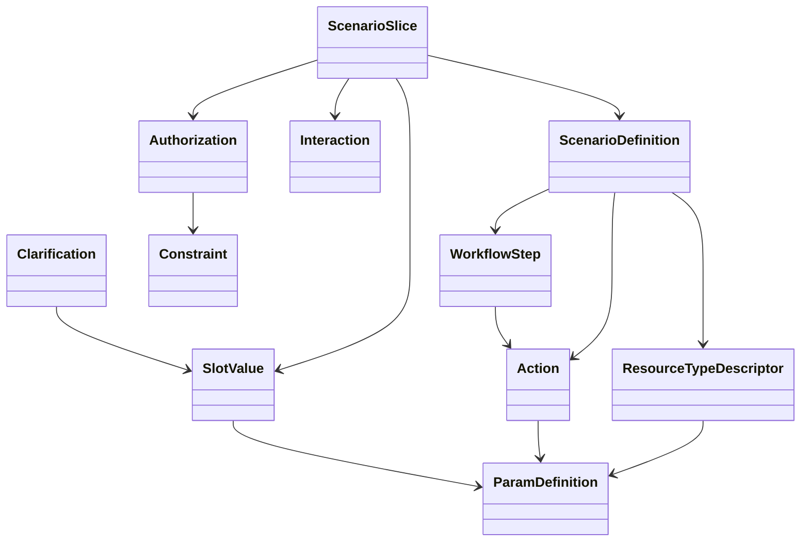
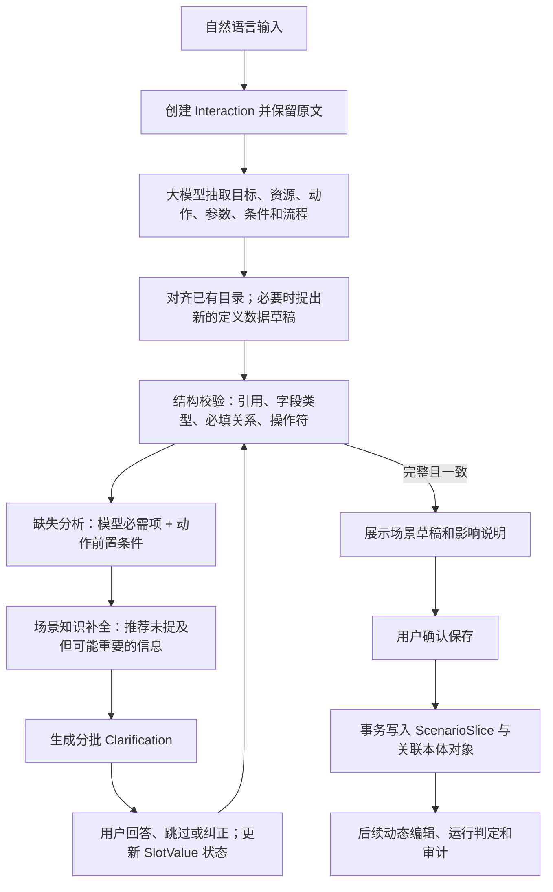
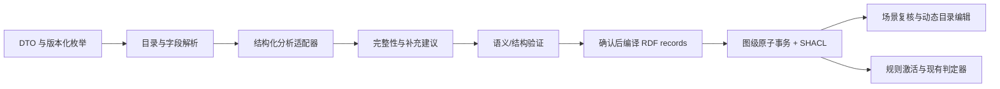

# 场景切片与通用场景元模型设计

> **现状更正（2026-10-02）** —— 本文是设计稿，其中两处与当前实现不一致，以本框为准：
>
> 1. **资源类型 / 动作 / 授权规则三个目录页已移除**（下文出现的"保留……页面 / 目录页"等指示
>    均已作废）。当时的判断是：那套"新建·编辑目录项"的管理式页面已过时——资源类型与动作
>    应由**场景分析**产出，而非手工维护。
>    代价是这三类数据一度在界面上不可见，曾导致"看不到资源类型""规则为什么不生效"等困惑。
>    当前的可见性方案：**场景切片页的分析面板**展示模型对字段的分档判断与理由，
>    场景实例页可在**偏好清单 ↔ 每次必填清单**之间直接改档（见 docs/09 §2）。
> 2. **元模型在本次迭代中新增了三项能力**（详见 `docs/09-scenario-analysis-schema.md`）：
>    - **字段三档分类**：`required`（每次必填）/ `preference`（长期偏好）/ `both`（两者兼有）
>    - **策略按动作限定**：`policies[].actions`，使"允许查看、禁止删除"可以正确表达
>    - **一个场景可有多个资源类型**（例如"文件"与"目录"）
>
> 契约、向后兼容规则与已知模型陷阱以 `docs/09` 为准。


状态：设计稿，尚未进入实现。

## 1. 目标与边界

场景切片为普通用户提供自然语言入口，把“我想做什么”转成可检查、可补充、可确认并可由现有管理页面继续编辑的本体数据。新场景应通过元数据表达，不要求为每个场景修改后端类、前端页面或固定字段。

本设计保留已有对象与 API 兼容方向；新增的场景对象连接现有资源、动作、授权、交互、判定和审计对象。大模型可以提取与建议，但不能把未确认的推断伪装成用户要求，也不能绕过本体校验直接落库。

## 2. 现有对象盘点与处理

当前 `backend/model.py` 定义的对象均保留，按职责分层如下。

| 职责 | 当前对象 | 设计处理 |
|---|---|---|
| 身份 | Principal | 保留；主体及父子关系仍为授权对象。 |
| 资源与动作目录 | ResourceTypeDescriptor、ParamDefinition、Action、Matcher | 保留并增强字段定义；参数定义升级为可自描述的通用字段定义，兼容现有 `ParamDefinition`。 |
| 授权与安全 | Authorization、Constraint、Redline、DecisionResult | 保留；Constraint 扩展为有类型、可执行的条件表达式；拒绝红线与判定结果仍独立。 |
| 交互和运行 | Interaction、Context、Decision、Execution、Evidence | 保留；场景交互关联 Interaction，实际授权通过 Decision，实际操作记入 Execution，证据仍由 Evidence 引用。 |
| 分类词表 | Taxonomy、TaxonomyItem | 保留；用于可扩展分类和选项，不承担整个场景 schema 的职责。 |
| 通知与平台能力 | ContactPoint、Notifier、CryptoProvider、Trigger、Notification | 保留；不强行塞入场景核心模型，场景流程可按需引用。 |

不在此次设计中删除或重命名现有 RDF 类。数据库迁移需保持历史 URI、已有 API 字段和审计记录可读。

## 3. 通用元模型

### 3.1 结构



### 3.2 概念职责

| 新概念 | 说明 |
|---|---|
| ScenarioDefinition（场景定义） | 可复用的任务结构：目标说明、资源类型、动作、字段定义、可选流程和检查线索。作为数据保存，不能是酒店专属代码。 |
| ScenarioSlice（场景实例） | 用户某一次实际任务：原始描述、目标、已确认值、待补项、建议项、状态和模型版本。用户可另行将其整理成私有可复用定义；默认不自动把一次请求推广成全局模板。 |
| WorkflowStep（流程步骤） | 可选的动作序列、前置条件、成功/失败分支以及是否需用户确认。 |
| ParamDefinition（扩展） | 通用字段定义，适用于资源属性、动作输入/输出、用户偏好和上下文。保留现有类名和旧字段，增加 `scope`、`value_schema`、`unit`、`examples`、`sensitivity`、`collection_policy`、`applies_to_ids` 等元数据。动作分别通过 `hasInputParam` / `hasOutputParam` 声明输入与输出字段。 |
| SlotValue（参数值） | 某个场景实例中某项字段的值与状态。状态至少包括 `unknown`、`suggested`、`asked`、`confirmed`、`rejected`、`not_applicable`。记录来源（用户、模型、系统）、置信度、更新时间和确认者。 |
| Clarification（补充询问） | 针对缺失必填项或模型建议生成的问题，保存问题、理由、关联字段、必需/建议级别和回答状态。问题文本可以动态生成，不必为每句问法造新类。 |
| Constraint（扩展） | 保留现有对象，表达有类型的布尔条件；至少包含字段路径、操作符、类型化值和单位。执行器只接受注册的安全操作符。 |
| Authorization（扩展） | 保留主体、资源、动作、效果和条件关系，增加策略生命周期状态，使生成草稿不立即参与判定。 |

`ScenarioDefinition` 允许引用已有 ResourceTypeDescriptor、Action、ParamDefinition、WorkflowStep 和可选检查提示；未遇到的领域词汇可成为新的定义数据。结构必须通过通用 schema 校验，不允许模型新增任意代码或任意可执行谓词。

### 3.3 字段定义与条件

字段定义需要支持常见数据类型：文本、数值、金额、布尔、枚举、日期、日期区间、时长、地点、对象引用和列表。类型定义可带单位、格式、上下界、选项来源、展示名称、说明和示例。

`collection_policy` 用于表达信息获取方式，例如：

- `required`: 执行动作前必须获得；
- `recommended`: 场景常见，建议询问但可跳过；
- `optional`: 仅在用户选择关注时收集；
- `derived`: 可由其他已确认数据安全计算；
- `not_collected`: 当前场景明确不使用。

用户输入的条件和偏好要区分：硬约束不满足时排除候选项；偏好用于排序或提示，不得擅自提升为硬性限制。金额字段必须保存币种和计价基准（例如每晚/全程），日期与时长也不能相互覆盖。

Constraint 的初期操作符应为固定白名单，如 `eq`、`neq`、`lt`、`lte`、`gt`、`gte`、`in`、`contains`、`between`、`before`、`after`、`exists`。比较前需校验类型、单位和字段来源；无法执行或单位不兼容时，规则不能得出 allow。

## 4. 信息完整性与主动建议

完整性检查分两条来源，界面上明确区分：

1. **模型定义的必要项**：动作的必填输入、流程前置条件或场景定义标明的必需信息。缺少时阻止进入可执行预览，生成明确追问。
2. **大模型的场景建议**：结合自然语言、通用场景定义及模型知识，提出可能有帮助但用户未提及的项目。每项包含理由、影响、建议优先级，用户可采纳、修改、跳过或标记不适用。

建议检查可分轮进行：先解决身份/目标和动作所需的必要信息，再询问会改变候选集的高影响条件，最后展示低优先级偏好。每轮控制问题数量，避免把知识清单一次性倾倒给用户。

模型建议不是事实，也不是默认偏好。必须保存为 `suggested` 状态，只有用户明确接受后才成为场景约束或偏好。若大模型不确定某属性是否相关，应使用“是否需要考虑……”的问法，并说明原因。

## 5. 酒店预订示例映射

用户输入：“当预定酒店的时候，要问清我的目标城市，酒店价格不超过500，我还关心酒店的位置，评价，是否有停车场，楼层，是否吸烟，时间，预定多少天。”

| 内容 | 映射结果 | 状态/追问 |
|---|---|---|
| 预定酒店 | 资源类型酒店；动作预订。可建议另设搜索、比较动作。 | “预订”动作已出现，不报为缺失；搜索/比较是系统建议。 |
| 目标城市 | 酒店搜索/预订动作的地点参数 | 用户明确要求必须问清；尚无城市值，必需追问。 |
| 价格不超过 500 | 价格上限条件 | 追问币种、每晚还是全程、税费是否计入；确认后才能生成机器条件。 |
| 位置、评价 | 酒店筛选属性/偏好 | 用户表达关注，但没有区域或评分阈值；可询问是否设置具体要求。 |
| 是否有停车场 | 酒店设施属性 | 建议询问是硬性要求还是有则优先。 |
| 楼层、是否吸烟 | 房间偏好属性 | 询问所需楼层范围、禁烟要求；允许跳过。 |
| 时间、住多少天 | 入住日期和住宿时长参数 | 询问入住日期及住宿晚数；日期和天数分别建字段并做一致性检查。 |
| 周边是否吵闹、是否临街 | 大模型补充的酒店场景建议 | 明确标注为系统建议，询问是否纳入，不预设值。 |
| 提交预订 | 流程步骤 | 预订前展示酒店、价格、日期和条款，要求用户确认；自然语言输入本身不等于确认下单。 |

酒店只是 `ScenarioDefinition` 的一条数据记录。位置、评价、停车、噪音等都是可扩展字段定义，通用编辑器按字段元数据生成控件，不为每个属性写页面代码。

## 6. 数据流与联合校验



职责边界：

- 大模型负责解析语言、提出候选映射和补充问题；输出必须是受 schema 限定的结构化草稿。
- 本体与 SHACL 负责类、关系、数据类型和基数等结构校验。
- 场景/动作定义负责判定必需参数和流程条件。
- 约束执行器负责检查受限操作符；SHACL 不替代运行时数值和日期计算。
- 用户负责确认建议、歧义消解和任何有外部影响的执行授权。

新增资源/动作/规则应在预览中一并显示来源与用途；一次确认使用事务写入，失败则回滚，避免只生成资源却遗漏动作或授权关系。

## 7. 页面菜单设计

一级菜单建议顺序：总览、主体、**场景切片**、资源类型、动作、授权规则、判定记录。

### 场景切片页面

1. 自然语言输入区：示例、场景目标、主体选择（默认可用当前主体，不让用户填 ID）。
2. 对话补充区：必需问题与系统建议分组；每条建议提供“采用 / 修改 / 跳过 / 不适用”。
3. 草稿预览：目标、资源、动作、信息项、硬约束、偏好、流程和确认点；标注用户输入、模型推断、待确认来源。
4. 冲突和风险区：单位不明、条件冲突、未注册动作、规则过宽或外部操作未确认时说明影响并阻止安全性不明的提交。
5. 保存后详情：展示资源、动作、授权规则及参数之间的关系，可跳转到现有菜单继续编辑。

### 目录编辑页面

（**已作废**，见文首现状更正）~~保留资源类型、动作、授权规则页面，但改为由元模型的字段定义驱动表单。~~新增类型/动作时不改页面代码；关联对象按显示名称选择；字段说明、示例、单位和校验均从元数据生成。高级配置可折叠显示，内部 ID 和系统状态不作为普通用户输入。

## 8. 校验与安全原则

- 用户明确输入、模型建议、模型推断、系统默认值必须有不同来源标记。
- 未确认的模型建议不能生成硬约束或扩大授权。
- 新建授权规则默认 draft；场景保存、规则启用、对外部服务执行下单是三个不同动作，不能由一句自然语言自动合并授权。
- 用户描述不能作为外部操作的最终确认；高影响动作设置明确的确认步骤。
- 动态定义仅可声明数据字段和注册过的操作符/流程节点，不可提供任意代码、查询或执行器入口。
- 字段敏感度、保留期及日志脱敏需跟随字段/槽位元数据设计；原始自然语言与场景值按隐私策略存储。
- 未知字段、未知操作符、单位不匹配、引用失效或校验超时均不得导致 allow。

## 9. 分阶段设计与实施顺序

1. **模型定稿**：明确 ScenarioDefinition/ScenarioSlice、通用字段、SlotValue、Clarification、WorkflowStep 与 Constraint 的属性和关系。
2. **兼容映射**：把现有 21 类对象逐一映射到新分层；为旧数据定义默认值和迁移规则，不删除旧 URI。
3. **校验契约**：确定动态字段 schema、SHACL 结构规则、语义校验及白名单约束操作符。
4. **酒店样例验证**：验证必需追问、推荐补全、价格单位、入住时长、确认流程能完整落到通用结构中。
5. **跨场景验证**：用另一个不同领域的场景验证不需要新增类或页面代码，再进入实现。

本文件是设计基线，不意味着新对象名称与最终 RDF 属性 URI 已冻结。实现前需完成类/属性清单、基数、版本与 API JSON 契约的逐项评审。

## 10. 类与属性契约（评审版）

以下基数描述确认后的持久化对象；分析期间允许字段缺失，由 `SlotValue` 和 `Clarification` 明确记录。所有对象使用系统生成 ID；显示名称用于用户界面，ID 只用于关系引用。

### 10.1 ScenarioDefinition

| 属性 | 类型/基数 | 说明 |
|---|---|---|
| `scenario_definition_id` | string，1 | 系统生成稳定标识。 |
| `display_name_zh` / `display_name_en` / `description_zh` / `description_en` | string，1 / 0..1 / 0..1 / 0..1 | 复用项目的中英文标签字段；中文名称必填，其余可选。 |
| `version` | string，1 | 数据定义版本，用于迁移和复现。 |
| `resource_type_ids` | ResourceTypeDescriptor，0..* | 场景会处理的资源类型。 |
| `action_ids` | Action，0..* | 场景可能涉及的动作。 |
| `param_definition_ids` | ParamDefinition，0..* | 场景字段及问询定义。 |
| `workflow_step_ids` | WorkflowStep，0..* | 可选流程模板，按 `sequence` 排序。 |
| `completeness_hints` | JSON，0..* | 场景补充建议的可选提示；须标注来源和版本，不能作为强制规则或授权。 |
| `lifecycle_state` | enum，1 | draft/active/deprecated；废弃后历史实例仍可读取。 |

场景定义不要求先验存在。大模型可在用户确认后创建为 draft；复用或共享前可再审核。未知领域不应阻断场景实例草稿。

### 10.2 ScenarioSlice

| 属性 | 类型/基数 | 说明 |
|---|---|---|
| `scenario_slice_id` | string，1 | 系统生成标识。 |
| `scenario_definition_id` | ScenarioDefinition，0..1 | 匹配已有定义时引用；否则允许暂时无引用。 |
| `owner_principal_id` | Principal，0..1 | 已解析当前用户时记录；未解析前不臆造身份。 |
| `original_input` | string，1 | 用户原文，不被模型改写覆盖。 |
| `normalized_goal` | string，0..1 | 经用户确认或明确标记为模型草拟的目标摘要。 |
| `status` | enum，1 | draft/clarifying/ready/confirmed/active/completed/abandoned；confirmed/active 是场景生命周期，不代表授权策略已启用。 |
| `slot_value_ids` | SlotValue，0..* | 本次场景的已知、缺失、建议和拒绝项。 |
| `clarification_ids` | Clarification，0..* | 询问记录。 |
| `interaction_ids` | Interaction，0..* | 关联当前系统已有的对话记录。 |
| `authorization_ids` | Authorization，0..* | 用户确认后建立或选择的规则。 |
| `revision` | integer，1 | 每次修改递增，以便比较草稿与确认版本。 |
| `created_at` / `updated_at` | dateTime，1 / 1 | 系统管理时间。 |

### 10.3 ParamDefinition 与 SlotValue

**ParamDefinition（兼容现有类）**保留 `param_name`、`param_type`、中英文显示名和 `required`，补充：

| 属性 | 基数 | 说明 |
|---|---:|---|
| `scope` | 1 | resource_attribute/action_input/action_output/context/preference。 |
| `applies_to_ids` | 0..* | 适用资源类型或动作。 |
| `value_schema` | 1 | 类型化定义；类型可为 string/number/boolean/enum/date/date_range/duration/money/location/reference/list/object。 |
| `unit` | 0..1 | 数值单位或金额币种语义，例如 CNY；单位不可从裸数字推断。 |
| `collection_policy` | 1 | required/recommended/optional/derived/not_collected。 |
| `examples` | 0..* | 供用户理解的值示例。 |
| `sensitivity` | 1 | public/personal/sensitive；影响展示、日志与保留策略。 |
| `validation_schema` | 0..1 | 范围、枚举、格式等数据约束，不允许执行代码。 |
| `display_order` | 0..1 | 动态表单展示顺序。 |

`SlotValue` 至少含 `slot_value_id`、`scenario_slice_id`、`param_definition_id`、`value`（JSON）、`state`、`provenance`、`confidence`（可空）、`source_text`（可选引用/片段）、`confirmed_by`（可空）和时间戳。`provenance` 取 user_explicit/user_confirmed/model_inferred/system_derived。推断值不得伪装为 user_explicit；重要条件不得仅凭置信度自动确认。

### 10.4 Clarification、WorkflowStep 与 Constraint

| 类 | 必需属性 | 说明 |
|---|---|---|
| Clarification | ID、slice、关联字段或缺项、question、reason、priority、requirement_level、status | `requirement_level` 为 blocking/recommended/optional；状态为 open/answered/skipped/not_applicable。回答写入对应 SlotValue，并保留原问答。 |
| WorkflowStep | ID、所属定义、sequence、action 引用或通用 step 类型、输入映射、前置条件、confirmation_policy | `confirmation_policy` 至少支持 never/when_high_impact/always；外部不可逆操作必须有显式用户确认。 |
| Constraint | ID、subject/path、operator、typed value、unit、hard_or_preference、source | 沿用现有 Constraint 类和 Authorization 关联，但将旧 `constraint_type`/`constraint_value` 映射到有类型表达；未知操作符或不兼容单位使约束无效，不能 allow。 |
| Authorization 生命周期 | `policy_status`：draft/active/suspended，默认 draft | 草稿规则可在菜单继续编辑；只有用户明确启用的 active 规则参与判定。暂停不等于撤销，现有 revoked 字段继续保留撤销语义。 |

场景切片中的推荐问题可以由模型即时生成，不必全部预先写成 Clarification 模板；持久化后每个问题仍使用同一个 Clarification 结构。

## 11. 通用 API 契约草案

分析能力应与具体大模型供应商解耦；API 返回结构化草稿和校验/追问，不要求前端直接拼装多个底层 CRUD 请求。

### 11.1 创建或继续分析

`POST /v1/scenario-slices/analyze`

```json
{
  "scenario_slice_id": null,
  "user_input": "当预定酒店的时候，价格不超过500……",
  "principal_id": null,
  "answers": [],
  "locale": "zh-CN"
}
```

响应包含 `scenario_slice` 草稿、`recognized`（明确识别内容）、`inferred`（未确认推断）、`suggestions`（补充建议及理由）、`clarifications`（需回答的问题）、`validation`（结构问题）和 `next_state`。继续分析时传入 slice ID 与本轮新增原文/回答；服务端保留原始轮次。

### 11.2 保存确认版本

`POST /v1/scenario-slices/{id}/confirm` 接收用户确认的槽位、被采纳/跳过的建议以及用户授权的流程选项。服务端重新验证后，在一个事务中写入 ScenarioSlice、必要的目录对象、Authorization/Constraint 关联及审计引用。新规则默认为 draft；“确认场景草稿”不自动等于“启用授权策略”，激活规则需在预览或规则菜单里单独明确操作。幂等键和 revision 用于避免重复提交及覆盖并发修改。

此外提供只读的 `GET /v1/scenario-slices/{id}`、列表接口及结构校验接口。已有通用 CRUD 保持可用；动态字段和值的 API schema 按 ParamDefinition 验证，而不是为每个新字段增加 Pydantic 类或专属端点。

如果一次场景只新增定义草稿但用户尚未确认，保存范围与状态必须明确；不得把模型生成的规则以 active/allow 状态静默启用。

## 12. 跨场景通用性检查：网购

输入：“帮我买一台笔记本，预算 8000 元以内，优先轻薄、评价好，不要二手；先比较几款，付款前让我确认。”

| 抽取结果 | 通用模型承载方式 |
|---|---|
| 商品、笔记本 | ResourceTypeDescriptor 与动态属性定义。 |
| 搜索、比较、下单、付款 | Action 与 WorkflowStep；动作参数通过 ParamDefinition 描述。 |
| 总价不超过 8000 元 | money 类型 SlotValue + `lte` Constraint，单位 CNY，预算口径明确为总价。 |
| 优先轻薄、评价好 | preference 类型条件，作为候选排序偏好，而非淘汰硬条件。 |
| 不要二手 | 商品成色硬条件；如“二手”字段不在目录，作为用户确认后的新属性定义数据，而非新代码类。 |
| 付款前让我确认 | 付款步骤的 confirmation_policy=always。 |
| 可能遗漏的信息 | 大模型可建议询问品牌、尺寸、用途、配送地区/时间；逐条给理由，用户可跳过。 |

该场景与酒店场景共用 ScenarioSlice、ParamDefinition、SlotValue、Clarification、WorkflowStep、Constraint、Action 和资源目录，不增加新元模型类或页面代码。若两类场景都能表达，且既有主体、通知、加密、触发器、决策、证据对象仍有清晰职责，则“可扩展且不丢旧能力”的方向成立。

## 13. 尚待定稿的决策

1. 场景定义是用户私有、可共享，还是分为个人库与系统库；默认按个人私有处理。
2. ScenarioSlice 与 Interaction 是一对多还是由 Interaction 作为场景实例本体；本稿暂选独立 ScenarioSlice，并关联一个或多个 Interaction，保留现有 Interaction 语义。
3. 自然语言模型部署位置、原文保留时间及敏感字段是否允许送至远端模型；需在实现前设定可见的隐私选项。
4. 动态条件执行器首批支持的类型和操作符；未实现的操作符必须显式标记不可执行，不能静默降级。
5. 新的 ScenarioDefinition 是否需要审核后共享；模型生成的定义默认 draft、不可自动对其他用户生效。

## 14. 建议采用的默认决策

为避免设计讨论停留在开放问题，建议首版按以下默认值推进：

1. **场景定义默认私有**：当前用户可复用；共享给其他主体需显式操作。系统内置定义只读并带版本。
2. **ScenarioSlice 独立于 Interaction**：一个场景可跨多个对话轮次；每轮仍记录为 Interaction，便于原样审计和恢复对话。
3. **模型隐私默认本地**：项目当前定位为本机服务，因此首版不把用户原文发送给未配置的远端模型。用户配置远端模型前需告知发送的数据类型；敏感字段默认脱敏，并允许用户关闭远端分析。
4. **安全操作符白名单**：只支持已经实现并验证的操作符；未支持条件让草稿保持不可启用，不转成无条件 allow。
5. **三个明确确认点**：确认参数和建议、保存场景与规则草稿、单独启用授权。实际预订等外部动作还需按 WorkflowStep 的确认策略再次确认。
6. **跨场景验证通过后再定类名**：先用酒店和网购验证；若二者只需新增定义数据而不需要专属代码类，才冻结 ScenarioDefinition/ScenarioSlice 等 RDF 类与属性 URI。

## 15. RDF 类与属性命名草案

沿用现有命名空间 `urn:personalontology:ontology#`、类名 UpperCamelCase、属性名 lowerCamelCase。以下是拟议 URI 名称，定稿前仍须检查与主 ontology 中已有属性是否重名。

| 类 | ID 属性 | 主要关系/属性 |
|---|---|---|
| `ScenarioDefinition` | `scenarioDefinitionId` | `displayNameZh`、`displayNameEn`、`descriptionZh`、`descriptionEn`、`scenarioVersion`、`lifecycleState`、`hasResourceType`、`hasAction`、`hasParamDefinition`、`hasWorkflowStep`、`completenessHints`。 |
| `ScenarioSlice` | `scenarioSliceId` | `usesScenarioDefinition`、`ownerPrincipal`、`originalInput`、`normalizedGoal`、`scenarioStatus`、`hasSlotValue`、`hasClarification`、`hasInteraction`、`hasAuthorization`、`revision`、`createdAt`、`updatedAt`。 |
| `SlotValue` | `slotValueId` | `slotDefinition`、`slotValue`（`rdf:JSON`）、`slotState`、`provenance`、`confidence`、`sourceText`、`confirmedBy`、`updatedAt`。 |
| `Clarification` | `clarificationId` | `belongsToScenario`、`asksForParam`、`clarificationQuestion`、`clarificationReason`、`clarificationPriority`、`requirementLevel`、`clarificationStatus`、`answerSlotValue`。 |
| `WorkflowStep` | `workflowStepId` | `stepOfScenario`、`stepSequence`、`invokesAction`、`stepType`、`inputMapping`（`rdf:JSON`）、`precondition`、`confirmationPolicy`。 |

`ParamDefinition` 扩展属性拟为：`paramScope`、`appliesToAction`、`valueSchema`（JSON Schema 子集，`rdf:JSON`）、`paramUnit`、`collectionPolicy`、`sensitivity`、`paramExamples`、`validationSchema`（受限 JSON 子集）、`displayOrder`。现有 `hasParam` 只保留资源类型到字段定义的关系；ScenarioDefinition 使用独立的 `hasParamDefinition`，Action 使用 `hasInputParam` / `hasOutputParam` 区分输入和输出，避免同一 OWL 属性出现多个不同 domain。

`Constraint` 保留 `constraintType`、`constraintValue`，增加 `constraintPath`、`constraintOperator`、`typedValue`（`rdf:JSON`）、`constraintUnit`、`constraintMode`（hard/preference）、`constraintSource`。`Authorization` 增加 `policyStatus`。其中 `typedValue` 与 `constraintValue` 暂时并存，迁移期间读写双格式，完成数据与 API 兼容后再考虑弃用旧字段；不得直接改写旧 URI 含义。

原有通用 ID/时间属性如 `createdAt` 保持复用；与对象语义有关的状态属性使用专属名称，避免让 `po:status` 继续承载多个互不相同的状态词表。

## 16. SHACL 校验边界

SHACL 负责 RDF 结构、属性类型、基数、枚举和引用对象类别；动态字段值的细节由 API 按 `valueSchema` 校验；运行时条件由约束执行器校验并求值。不要让一个 SHACL shape 为酒店参数、网购参数各写一套专属字段路径。

主要 shape 约束如下：

| Shape | 关键结构约束 |
|---|---|
| ScenarioDefinitionShape | ID/version/state 恰好一个；名称必填；所有资源/动作/参数/步骤关系都指向正确类。已启用定义需有至少一个动作或明确的非执行型目标。 |
| ScenarioSliceShape | ID/status/revision/原始输入必填；定义和 owner 可选；槽位、询问、Interaction、Authorization 均需正确类引用。confirmed 不能含未解决的 blocking clarification。 |
| ParamDefinitionShape（扩展） | 字段名、scope、type、collectionPolicy 必填；`valueSchema` 为 JSON；参数定义的输入/输出 scope 与关联动作一致。 |
| SlotValueShape | 恰好关联一个场景和字段定义；状态、来源在各自枚举内；confidence 为 0..1；confirmed 值必须存在且通过参数 schema 校验。 |
| ClarificationShape | 必须关联一个场景；question、requirementLevel、status 必填；answered 项必须关联答案槽位；skipped 不得被当作已有值。 |
| WorkflowStepShape | 所属定义和 step type 必填；sequence 为非负整数且在同一定义中唯一；action 引用可选但若有必须存在；confirmation policy 在枚举内。 |
| ConstraintShape（扩展） | path、operator、mode 必填；operator 为已注册白名单；typed value 为 JSON；比较值和字段 schema/unit 兼容。纯 SHACL 不能完成的跨节点单位与操作符校验由 API/执行器负责。 |
| AuthorizationShape（扩展） | 新规则必须有 policyStatus；仅 active 规则进入判定；draft/suspended 不能产生 allow。迁移旧规则时按兼容规则补状态。 |

示意 shape（展示方向，不是可直接合并的最终 Turtle）：

```turtle
po:SlotValueShape a sh:NodeShape ; sh:targetClass po:SlotValue ;
  sh:property [ sh:path po:slotValueId ; sh:minCount 1 ; sh:maxCount 1 ; sh:datatype xsd:string ] ;
  sh:property [ sh:path po:slotDefinition ; sh:minCount 1 ; sh:maxCount 1 ; sh:class po:ParamDefinition ] ;
  sh:property [ sh:path po:slotValue ; sh:maxCount 1 ; sh:datatype rdf:JSON ] ;
  sh:property [ sh:path po:slotState ; sh:minCount 1 ; sh:in ("unknown"^^xsd:string "suggested"^^xsd:string "asked"^^xsd:string "confirmed"^^xsd:string "rejected"^^xsd:string "not_applicable"^^xsd:string) ] ;
  sh:property [ sh:path po:provenance ; sh:minCount 1 ; sh:in ("user_explicit"^^xsd:string "user_confirmed"^^xsd:string "model_inferred"^^xsd:string "system_derived"^^xsd:string) ] .
```

状态之间的跨对象规则（例如场景进入 ready 前 blocking 问题都已回答或明确跳过）需要事务级语义校验；不能只靠目标类 Shape 的局部属性检查。

## 17. 现有对象兼容与迁移表

升级使用**加法式、可回滚迁移**：先备份；新增属性；回填兼容值；部署支持新旧字段读取的 API；核对图、约束判定和历史审计后再进入新写入模式。迁移期间不删除旧三元组、不改已有 subject URI。

| 现有对象 | 兼容方式 | 迁移默认值/注意点 |
|---|---|---|
| Principal | 原类、ID、层级不变 | 不重写用户主体 ID；匿名或未解析 owner 保持空。 |
| ResourceTypeDescriptor | 原类与 ID 不变；继续复用 `hasParam` | 已有关联参数补出兼容 `valueSchema`；未知语义不猜单位，不改成酒店专用资源类。 |
| ParamDefinition | 原类、`paramName`、`paramType`、required 和标签保留 | 旧 `string/number/bool/date` 映射到新 schema 基本类型；scope 暂设 `resource_attribute`（若仅挂资源），required 映射到 collectionPolicy=required/optional；需要动作输入的必须人工/规则确认，不能仅凭字段名推断。 |
| Action | 原 ID、风险和资源关系保留 | 新增输入/输出参数关系为空合法；后续通过菜单或场景草稿补全。 |
| Authorization | 原 ID、主客体、资源、动作、effect、期限、撤销字段保留 | 旧规则回填 `policyStatus=active` 以保持现有判定语义；场景生成的新规则为 draft。后续用户启用/暂停时仅修改状态，不改历史 ID。 |
| Constraint | 原 `constraintType`、`constraintValue` 原样保留 | 若类型能无损映射（如 `context_equals` → path+eq，`source_trust_min` → path+rank_gte/固定等级表），增加新属性；否则标为 legacy/unexecutable 并阻止其扩大授权，等待用户修订。 |
| Redline | 保持原拒绝语义和 URI | 不自动把普通筛选条件转换为红线；其含义是硬拒绝规则。 |
| DecisionResult | ID、nextAction、severity 保留 | 不改既有 allow/deny/ask/pause 结果映射。 |
| Decision | 历史判定及引用保持只读 | 新决策可增加场景引用；历史决策不虚构 ScenarioSlice。 |
| Interaction | ID、session、原始输入和时间保持 | 作为对话轮次继续使用；有明确关联时新增指向 ScenarioSlice 的关系，孤立历史 Interaction 保持孤立。 |
| Context | 原字段保持 | 新的酒店/网购参数不塞入固定 Context 字段；仅通用运行上下文留在此类。 |
| Execution | 历史执行记录只读 | 新流程可由 WorkflowStep 生成执行；仍关联原 Decision 和 Interaction。 |
| Evidence | 摘要和引用不变 | 可引用用户确认、输入来源或外部依据；遵循现有隐私和保留政策。 |
| Taxonomy、TaxonomyItem | 保持已有树和 ID | 可作为通用枚举来源，但不得把所有动态字段硬编码成 Taxonomy。 |
| Matcher | 保留已注册匹配行为 | 新模型不允许自然语言生成 Matcher 代码。 |
| ContactPoint | 保留验证和 disclosure 语义 | 地址/电话等敏感数据仍走该类的隐私保护；场景 SlotValue 不复制明文联系资料，宜存引用。 |
| Notifier、CryptoProvider、Trigger、Notification | 类、配置和历史记录不迁移或重命名 | 按需从 WorkflowStep 引用；首版不因场景功能而改变其运行逻辑。 |

### 17.1 约束对象迁移风险

当前图模型将 Authorization 的 `constraints` 作为 Constraint 节点引用，而运行时 `_constraints_match` 读取的是内嵌字典列表。迁移前必须补齐读取路径：从 URI 取回 Constraint 节点，解码为规范表达式，再交由执行器校验。不能只新增 RDF 属性就宣称酒店价格或旧约束已经可执行。对于不能安全迁移的旧约束，保留原数据并报告需复核；它不得静默变成空约束后仍产生 allow。

### 17.2 迁移检查点

每阶段需生成迁移报告：迁移前后各类节点数、无效引用、无法转换字段、旧约束执行状态、授权 active/draft 数量。先在数据副本上迁移并验证 SHACL、API 往返和判定回归；验证通过后再切换正式数据。回滚通过恢复升级前备份完成，升级过程不对用户数据做不可逆删改。

## 18. 尚待实现前确认的事项

前文已形成 URI、域/值域、基数、枚举、规范 JSON 和迁移方向草案；以下仍需在进入实现前冻结：

1. **JSON Schema 白名单**：首版只开放 type、properties、items、required、enum、minimum/maximum、minLength/maxLength、additionalProperties=false 及固定 format（date/date-time/currency-code）；暂不开放 pattern、$ref、条件 schema 或执行脚本，避免 regex 回溯和外部引用风险。
2. **定义与提示的来源**：模型提出的新 ScenarioDefinition 和 completenessHints 默认个人私有、draft，是否纳入系统共享目录须显式审核。
3. **模型部署与隐私策略**：本地模型能力、远端服务选项、脱敏字段、原文保留时间要在产品设置中有可见说明。
4. **条件执行覆盖率**：逐个确认白名单操作符已实现；未实现的类型应使规则保持不可启用，不以 SHACL 通过代替执行能力。
5. **旧数据迁移例外**：盘点图中实际 Constraint 节点与格式，按迁移报告逐项决定自动转换或人工复核；不能假定所有现存规则可无损迁移。

## 19. RDF 属性域、值域和基数草案

以下基数按单个 subject 的三元组计数；同名属性如 `createdAt` 继续复用时，域和值域不应通过重复 `rdfs:domain` 声明来“合并”，应保持无 domain 或新增语义专属属性。核心关系用 IRI，动态值只写在 SlotValue/Constraint 的 JSON literal 中，不创建酒店专属 RDF 谓词。

| 属性 | Domain → Range | 基数 | 备注 |
|---|---|---:|---|
| `scenarioDefinitionId` | ScenarioDefinition → xsd:string | 1 | 类内唯一。 |
| `displayNameZh` / `displayNameEn` / `descriptionZh` / `descriptionEn` | ScenarioDefinition → xsd:string | 1 / 0..1 / 0..1 / 0..1 | 复用项目已有通用中英文标签/说明属性；这些属性保持无 domain 声明，并由 Shape 限定目标类。 |
| `scenarioVersion` | ScenarioDefinition → xsd:string | 1 | 语义版本；改字段契约时递增。 |
| `lifecycleState` | ScenarioDefinition → xsd:string | 1 | draft/active/deprecated。 |
| `hasResourceType` | ScenarioDefinition → ResourceTypeDescriptor | 0..* | 场景可逐步解析资源。 |
| `hasAction` | ScenarioDefinition → Action | 0..* | 需有动作或被明确标记为信息收集/咨询型场景。 |
| `hasParamDefinition` | ScenarioDefinition → ParamDefinition | 0..* | 独立于 ResourceTypeDescriptor 的既有 `hasParam` 关系。 |
| `hasWorkflowStep` | ScenarioDefinition → WorkflowStep | 0..* | 0..* 表示只有目标、尚未定义固定流程。 |
| `completenessHints` | ScenarioDefinition → rdf:JSON | 0..* | 提示数据，不是规则或模型输出事实。 |
| `scenarioSliceId` | ScenarioSlice → xsd:string | 1 | 类内唯一。 |
| `usesScenarioDefinition` | ScenarioSlice → ScenarioDefinition | 0..1 | 可先保存未分类场景。 |
| `ownerPrincipal` | ScenarioSlice → Principal | 0..1 | 身份未解析前留空。 |
| `originalInput` | ScenarioSlice → xsd:string | 1 | 首轮原文；每轮原始问答仍由 Interaction 保存。 |
| `normalizedGoal` | ScenarioSlice → xsd:string | 0..1 | 模型草稿或用户修订内容。 |
| `scenarioStatus` | ScenarioSlice → xsd:string | 1 | draft/clarifying/ready/confirmed/active/completed/abandoned。 |
| `hasSlotValue` | ScenarioSlice → SlotValue | 0..* | 参数实例。 |
| `hasClarification` | ScenarioSlice → Clarification | 0..* | 追问与处理状态。 |
| `hasInteraction` | ScenarioSlice → Interaction | 0..* | 关联本轮及后续交互。 |
| `hasAuthorization` | ScenarioSlice → Authorization | 0..* | 草稿策略和已启用策略都可被引用，状态由 Authorization 决定。 |
| `revision` | ScenarioSlice → xsd:integer | 1 | >=1，递增。 |
| `createdAt` / `updatedAt` | ScenarioSlice → xsd:dateTime | 1 / 1 | 更新时间每次成功修订时更新。 |
| `paramScope` | ParamDefinition → xsd:string | 1 | resource_attribute/action_input/action_output/context/preference。 |
| `appliesToAction` | ParamDefinition → Action | 0..* | 该字段适用的动作。 |
| `hasInputParam` / `hasOutputParam` | Action → ParamDefinition | 0..* | 输入与输出分开；作为 `scope` 的反向关系校验。 |
| `valueSchema` | ParamDefinition → rdf:JSON | 1 | 受限 JSON Schema 子集。 |
| `paramUnit` | ParamDefinition → xsd:string | 0..1 | 简单物理单位；金额单位应通过值结构中的 currency 表达。 |
| `collectionPolicy` | ParamDefinition → xsd:string | 1 | required/recommended/optional/derived/not_collected。 |
| `sensitivity` | ParamDefinition → xsd:string | 1 | public/personal/sensitive。 |
| `paramExamples` / `validationSchema` / `displayOrder` | ParamDefinition → rdf:JSON / rdf:JSON / xsd:integer | 0..* / 0..1 / 0..1 | 展示示例、受限校验 schema、动态表单顺序。 |
| `slotValueId` | SlotValue → xsd:string | 1 | 类内唯一。 |
| `slotDefinition` | SlotValue → ParamDefinition | 1 | 必须引用字段定义。 |
| `slotValue` | SlotValue → rdf:JSON | 0..1 | unknown/suggested/rejected 等无值状态允许省略。 |
| `slotState` / `provenance` | SlotValue → xsd:string | 1 / 1 | 采用第 3.2 节枚举。 |
| `confidence` / `sourceText` / `confirmedBy` / `updatedAt` | SlotValue → xsd:decimal / xsd:string / Principal / xsd:dateTime | 0..1 / 0..1 / 0..1 / 1 | confidence 范围 0..1；来源片段可脱敏；confirmedBy 仅用户确认时写入。 |
| `clarificationQuestion` / `clarificationReason` | Clarification → xsd:string | 1 / 1 | 给用户看的问题及原因。 |
| `clarificationId` | Clarification → xsd:string | 1 | 类内唯一。 |
| `belongsToScenario` | Clarification → ScenarioSlice | 1 | 每条询问只属于一个场景实例。 |
| `asksForParam` | Clarification → ParamDefinition | 0..1 | 对场景整体提问时可省略；缺项问题应引用字段。 |
| `clarificationPriority` / `requirementLevel` / `clarificationStatus` | Clarification → xsd:integer / xsd:string / xsd:string | 1 / 1 / 1 | 优先级仅用于排序；blocking/recommended/optional 与 open/answered/skipped/not_applicable 分开校验。 |
| `answerSlotValue` | Clarification → SlotValue | 0..1 | answered 时恰好一个；其他状态不得引用答案。 |
| `stepOfScenario` | WorkflowStep → ScenarioDefinition | 1 | 每个定义步骤只归属一个定义。 |
| `stepSequence` | WorkflowStep → xsd:integer | 1 | >=0；同一场景定义内唯一。 |
| `invokesAction` | WorkflowStep → Action | 0..1 | stepType=clarify/confirm/notify 等非动作步骤可为空。 |
| `precondition` | WorkflowStep → Constraint | 0..* | 每步可有多个前置条件。 |
| `confirmationPolicy` | WorkflowStep → xsd:string | 1 | never/when_high_impact/always。 |
| `constraintPath` / `constraintOperator` | Constraint → xsd:string | 1 / 1 | 字段路径和安全白名单操作符。 |
| `typedValue` | Constraint → rdf:JSON | 1 | 结构化操作数。 |
| `constraintUnit` | Constraint → xsd:string | 0..1 | 应与 ParamDefinition 的单位/值结构兼容。 |
| `constraintMode` | Constraint → xsd:string | 1 | hard/preference。 |
| `policyStatus` | Authorization → xsd:string | 1 | draft/active/suspended；仅 active 可进入授权合并。 |

多语言名称沿用当前 `displayNameZh`/`displayNameEn` 和 `descriptionZh`/`descriptionEn`。这些共享属性保持不声明 `rdfs:domain`，由各类 SHACL Shape 限定适用对象；新增语义专属属性则声明单一 domain，避免累加多个 domain 造成 OWL 交集语义。

## 20. 动态值与规范表达式示例

### 20.1 字段定义与槽位值

金额不宜只存一个 `500` 数字。定义使用 JSON Schema 子集，场景值则携带币种和口径：

```json
{
  "param_name": "maximum_price",
  "param_scope": "preference",
  "display_name_zh": "最高预算",
  "value_schema": {
    "type": "object",
    "required": ["amount", "currency", "basis"],
    "properties": {
      "amount": {"type": "number", "minimum": 0},
      "currency": {"type": "string", "format": "currency-code"},
      "basis": {"type": "string", "enum": ["per_night", "whole_stay"]}
    }
  },
  "collection_policy": "required"
}
```

原句只给了“500”，因此场景初稿不应直接写入 confirmed SlotValue；可以保存提取结果为候选值并建立 blocking clarification，待币种和口径回答后再形成完整值。若用户答“每晚 500 元”，值为 `{"amount":500,"currency":"CNY","basis":"per_night"}`，来源为 user_confirmed。

### 20.2 条件规范 JSON

RDF 的 Constraint 节点解码到规则执行器时统一转成：

```json
{
  "path": "hotel.price",
  "operator": "lte",
  "value": {"amount": 500, "currency": "CNY", "basis": "per_night"},
  "mode": "hard",
  "source": "user_confirmed"
}
```

`path` 必须能解析到与酒店资源或搜索结果关联的 ParamDefinition；值结构必须符合该定义；`operator` 必须登记；币种和 basis 必须一致。不满足其中任一项时，此条件标记 invalid/unresolved，场景不能被标记 ready，Authorization 也不能启用。

偏好例如“评价高”不能编造阈值。可先以偏好槽位 `hotel.rating_preference` 记录未定值，然后询问用户是否有具体最低评分；若用户只表示“越高越好”，它作为排序偏好处理而不是硬条件。

## 21. 旧约束到规范表达式的转换

转换器按已知旧类型显式注册，不根据字符串猜测操作符：

| 旧 constraint_type | 旧字段/值 | 新表达式映射 | 处理规则 |
|---|---|---|---|
| `context_equals` | `key` 与 `constraint_value` | path=`context.{key}`、operator=`eq`、value=旧值 | 只有 key 在已登记上下文 schema 时自动迁移；否则 legacy/unexecutable。 |
| `source_trust_min` | `constraint_value` 为 low/medium/high | path=`context.source_trust`、operator=`rank_gte` | `rank_gte` 使用固定等级表 low<medium<high；不可映射为普通字典序比较。 |
| 其他未知值 | 任意 | 不自动转换 | 保留旧三元组、标记 needs_review；该规则不得因转换为空条件而获得 allow。 |

Constraint API 往返和 evaluator 必须共享一个规范 JSON Schema 版本。RDF→规范 JSON→判定→审计结果要能往返追溯 `constraint_id` 和原始定义；判定记录保存的是执行时引用/快照，避免后续修改规则抹掉历史依据。

## 22. 可执行迁移步骤

| 阶段 | 操作 | 成功条件/回滚点 |
|---|---|---|
| 0. 盘点 | 对数据图只读统计 21 类节点、ID、引用、旧约束类型、未通过当前 SHACL 的记录。 | 导出脱敏报告和备份校验摘要；不输出联系人明文。 |
| 1. 兼容发布 | 部署可读旧/新字段的 model/API；新图仍允许旧 Constraint 结构。 | 旧 API CRUD 往返不变。 |
| 2. RDF 增量迁移 | 为已有 ParamDefinition 增加可无损的基础 schema；为旧 Authorization 补 active；旧 Constraint 按白名单映射或标记复核。 | 节点数/URI 不变；所有改变可由迁移日志逆向解释。 |
| 3. 结构校验升级 | 加入新类 SHACL shape；按迁移阶段采用旧/新 `sh:or` 或先回填再收紧必填项。 | 旧图通过新 Shape；不通过项有分类报告且不会静默放行。 |
| 4. 判定器升级 | 从 Constraint URI 加载节点，转换到规范表达式；在执行前检查 policyStatus。 | 旧规则回归行为一致；draft/suspended 永不 allow；未知约束不能放行。 |
| 5. 新 API 与 UI | 增加场景 Slice/Clarification API 和元数据驱动字段渲染；保持旧集合 endpoint。 | 酒店、网购数据往返一致，关系引用有效。 |
| 6. 正式切换 | 用户数据备份后切换写入版本，逐步允许新建场景。 | 报告、审计与回滚包齐备；出错可整体恢复备份。 |

迁移应当可重复执行：每项增量写入检测是否已存在；重复运行不重复创建节点、不产生不同 ID。正式版启用新 Shape 后，schema 版本、迁移版本和数据版本必须一起记录。

## 23. 规范字段名与生命周期

为避免同一字段在 API、RDF 和文档中漂移，首版采用以下约定：API 使用 snake_case，RDF 使用 lowerCamelCase；下表是唯一映射表。`id` 在 API 中作为通用主键返回，RDF 仍保存类专属 ID 属性。

| API 字段 | RDF 属性 | API 类型 |
|---|---|---|
| `scenario_definition_id` / `version` / `lifecycle_state` | `scenarioDefinitionId` / `scenarioVersion` / `lifecycleState` | string |
| `display_name_zh` / `display_name_en` / `description_zh` / `description_en` / `completeness_hints` | `displayNameZh` / `displayNameEn` / `descriptionZh` / `descriptionEn` / `completenessHints` | string / optional string / optional string / optional string / JSON 数组 |
| `resource_type_ids` / `action_ids` / `param_definition_ids` / `workflow_step_ids` | `hasResourceType` / `hasAction` / `hasParamDefinition` / `hasWorkflowStep` | ID 数组 |
| `param_ids`（ResourceTypeDescriptor） | `hasParam` | ID 数组 |
| `input_param_ids` / `output_param_ids`（Action） | `hasInputParam` / `hasOutputParam` | ID 数组 |
| `scenario_slice_id` / `scenario_definition_id` / `owner_principal_id` | `scenarioSliceId` / `usesScenarioDefinition` / `ownerPrincipal` | string / optional ID |
| `original_input` / `normalized_goal` / `status` / `revision` | `originalInput` / `normalizedGoal` / `scenarioStatus` / `revision` | string / enum / integer |
| `slot_value_ids` / `clarification_ids` / `interaction_ids` / `authorization_ids` | `hasSlotValue` / `hasClarification` / `hasInteraction` / `hasAuthorization` | ID 数组 |
| `param_scope` / `applies_to_action_ids` / `value_schema` / `unit` / `collection_policy` / `sensitivity` / `display_order` | `paramScope` / `appliesToAction` / `valueSchema` / `paramUnit` / `collectionPolicy` / `sensitivity` / `displayOrder` | enum / ID 数组 / JSON / string / enum / enum / integer |
| `param_name` / `param_type` / `required` / `display_name_zh` / `display_name_en` | `paramName` / `paramType` / `paramRequired` / `displayNameZh` / `displayNameEn` | string / legacy type enum / boolean / string / string |
| `param_examples` / `validation_schema` | `paramExamples` / `validationSchema` | JSON 数组 / optional JSON |
| `slot_value_id` / `param_definition_id` / `value` / `state` / `provenance` / `confidence` / `source_text` / `confirmed_by` / `updated_at` | `slotValueId` / `slotDefinition` / `slotValue` / `slotState` / `provenance` / `confidence` / `sourceText` / `confirmedBy` / `updatedAt` | string / ID / JSON / enum / enum / optional decimal / optional string / optional ID / dateTime |
| `clarification_id` / `scenario_slice_id` / `asks_for_param_id` / `question` / `reason` / `priority` / `requirement_level` / `status` / `answer_slot_value_id` | `clarificationId` / `belongsToScenario` / `asksForParam` / `clarificationQuestion` / `clarificationReason` / `clarificationPriority` / `requirementLevel` / `clarificationStatus` / `answerSlotValue` | string / ID / optional ID / string / string / integer / enum / enum / optional ID |
| `workflow_step_id` / `scenario_definition_id` / `sequence` / `action_id` / `step_type` / `input_mapping` / `preconditions` / `confirmation_policy` | `workflowStepId` / `stepOfScenario` / `stepSequence` / `invokesAction` / `stepType` / `inputMapping` / `precondition` / `confirmationPolicy` | string / ID / integer / optional ID / enum / JSON / Constraint ID 数组 / enum |
| `constraint_path` / `operator` / `value` / `unit` / `mode` / `source` | `constraintPath` / `constraintOperator` / `typedValue` / `constraintUnit` / `constraintMode` / `constraintSource` | string / enum / JSON / optional string / enum / enum |
| `policy_status` | `policyStatus` | draft/active/suspended |

RDF 关系在 API 响应中统一序列化成 ID，不把 URI 或裸内部节点地址暴露给用户界面。`input_mapping`、`value_schema` 和 `typedValue` 只允许指定的 JSON 子集：禁止 `$ref` 远端加载、脚本、自定义函数、任意表达式和执行钩子；首版允许的 JSON Schema 关键字需单独列入实现白名单。

旧 API 的 `required` 保留为兼容字段，读出时由 `collection_policy == "required"` 推导；新 API 写入以 `collection_policy` 为准。recommended/optional/derived/not_collected 在旧布尔字段上都映射为 `required=false`，所以旧客户端只读时会丢失策略细分，但不得把旧客户端写入的 false 覆盖已有的新策略值。需要用 API 版本或明确字段优先级处理该兼容边界。

### 23.1 场景和规则的状态转换

| 对象 | 合法转换 | 守卫条件 |
|---|---|---|
| ScenarioSlice | draft → clarifying → ready → confirmed → active → completed | 当前步校验通过；ready 表示必需信息齐备；confirmed 表示用户确认场景配置；active 表示用户开始执行该场景。任何未完成状态可转 abandoned。 |
| ScenarioSlice 修订 | ready/confirmed → clarifying | 用户修改了必需字段或规则，必须重新跑完整性与语义检查；confirmed 状态回退，旧 revision 保留。 |
| Clarification | open → answered / skipped / not_applicable | answered 必须产生已校验 SlotValue；blocking 项不可 skipped，只能回答或经用户说明确实不适用。recommended/optional 项允许 skipped。 |
| SlotValue | unknown → suggested/asked → confirmed/rejected/not_applicable | model_inferred 不能直接进入 confirmed；必须由用户确认，或符合可解释、确定性的 system_derived 规则。 |
| Authorization | draft → active → suspended；撤销通过现有 `revoked=true` 表示 | `policyStatus` 仅取 draft/active/suspended；draft/suspended 或 revoked=true 均不参与 allow。active 需主体、资源、动作、条件均有效并由用户显式启用。 |

`ScenarioSlice.status=confirmed` 不会自动设置 `Authorization.policyStatus=active`；`ScenarioSlice.status=active` 也不绕过授权判定或 WorkflowStep 的外部操作确认。

## 24. 代码结构设计

本节把元模型映射到当前 FastAPI + RDFLib + 原生 JavaScript 项目结构。它是代码设计，不代表本节所列模块已经实现。

### 24.1 后端模块边界

建议在现有 `backend/` 下增加 `scenarios/` 包；不要把提示词、对话编排、RDF 转换和约束执行继续累加进 `api.py` 或 `store.py`。

```text
backend/
  api.py                         # 保留健康检查、现有 CRUD、判定路由
  model.py                       # 现有类/字段映射；逐步增加新 collection 映射
  store.py                       # 现有 RDF 图、事务写入、 SHACL 验证
  scenario_api.py                # 场景 Slice 路由与请求/响应 DTO
  scenarios/
    dto.py                       # API DTO、枚举和 schema 版本
    service.py                   # 用例编排：draft、answer、confirm、activate
    analyzer.py                  # LLMProvider 接口及结构化输出适配
    completeness.py              # 必填缺项与补充建议合并、排序
    catalog.py                   # 本体目录检索、实体匹配、动态字段定义
    validator.py                 # JSON Schema 子集、引用与场景语义校验
    compiler.py                  # 确认后的场景草稿编译成 RDF record 集合
    constraints.py               # Constraint RDF ↔ 规范表达式；安全求值
    migration.py                 # 显式、可回滚的数据升级入口
```

职责边界：

- `analyzer.py` 不写图、不启用规则；只返回满足 DTO schema 的候选结构、解释和不确定项。
- `completeness.py` 将动作定义的 blocking 参数检查与模型的 recommended 提议分开输出，不能把建议升级成必填。
- `catalog.py` 根据已存在的资源、动作、参数定义进行名称/别名匹配；候选不唯一时保留歧义并问用户，不自动新建重复对象。
- `validator.py` 校验字段类型、单位、跨引用和流程；遇到未知字段/操作符时保持 draft/invalid。
- `compiler.py` 只在用户确认之后生成普通的 ResourceTypeDescriptor、Action、Authorization、Constraint 等既有对象及 ScenarioSlice 关联。
- `constraints.py` 是唯一约束解码和执行入口；授权判定器不再自行解释 RDF URI 或接受不可信任的自由表达式。
- `store.py` 提供图级原子事务：复制候选图、批量写入全部相关记录、验证整图、一次持久化；任一步失败则不替换正式图。

`LLMProvider` 应是协议/接口，不绑定供应商。默认未配置模型时，自然语言分析接口返回明确的 provider-not-configured 错误，不生成伪造结果；本地或远端实现通过配置注入。所有 provider 输出先过 `dto.py` 的严格解析，再进入验证链。

### 24.2 API 路由草案

新增场景路由应在现有 `/{collection}` 通用路由之前注册，避免通用路径误吞或改变既有行为。建议把“创建草稿、回答追问、确认保存、启用策略”作为可区分操作：

| Endpoint | 用途 | 数据副作用 |
|---|---|---|
| `POST /v1/scenario-slices/analyze` | 首次输入或追加一轮自然语言，返回识别结果、建议和追问。 | 建立或修订 draft；写入原始 Interaction。不得建立 active Authorization。 |
| `GET /v1/scenario-slices/{id}` | 读取草稿/已保存场景和关联项。 | 无。 |
| `POST /v1/scenario-slices/{id}/answers` | 提交用户对 clarification 的回答、跳过或“不适用”。 | 更新 SlotValue 与追问状态，重新跑完整性检查。 |
| `POST /v1/scenario-slices/{id}/validate` | 返回结构、语义、执行能力和冲突报告。 | 无。 |
| `POST /v1/scenario-slices/{id}/confirm` | 确认配置，生成/更新目录对象和规则草稿。 | 图级事务写入；所有新 Authorization 保持 draft。 |
| `POST /v1/scenario-slices/{id}/activate` | 用户明确启用其中一条或一组规则。 | 独立校验后将指定 `policyStatus` 改为 active，写入审计。 |
| `POST /v1/scenario-slices/{id}/execute` | 请求开始某个流程步骤（可后续版本实现）。 | 先跑授权判定；按 WorkflowStep 逐步执行，外部高影响动作要求单独确认。 |

此处 `/analyze` 是显式静态子路径，需保证路由注册顺序和 FastAPI 测试覆盖。现有 `/v1/{collection}`、CRUD、`/v1/decisions/evaluate` 契约保持不变；通用 CRUD 可以读取新 collection，但不能通过 PATCH 绕过场景状态守卫或策略启用守卫。

### 24.3 内部 DTO 与存储格式

API DTO 与 RDF record 分层：DTO 用 snake_case 与用户界面交流；`model.py` 做 RDF 关系映射；`compiler.py` 负责从场景 DTO 生成一组类型化 record。不能直接将大模型的任意 JSON 合并进 RDF 图。

分析结果内部至少分成：

```json
{
  "recognized": [],
  "inferred": [],
  "suggestions": [],
  "slot_values": [],
  "clarifications": [],
  "validation": {"errors": [], "warnings": []},
  "next_state": "clarifying"
}
```

各数组项需携带稳定的字段/实体引用、source/provenance 和用户可读解释。API 序列化时不给普通界面暴露 RDF URI；引用以 opaque ID 传递，展示名称另行提供。`slot_value`、`value_schema` 和 typed condition JSON 均须过相同版本的 schema validator。

RDF 持久层：

- `ScenarioDefinition`、`ScenarioSlice`、`SlotValue`、`Clarification`、`WorkflowStep` 作为独立 subject，便于追溯、引用和状态更新。
- 参数值及验证 schema 用 `rdf:JSON` literal；资源、动作、主体、约束关系仍用 IRI。
- 除审计快照外，Constraint 的可执行定义只存一份规范结构；判定时通过 URI 加载其记录并转换，避免 RDF 值和内嵌 API 字典双重真相。
- 每次 ScenarioSlice 修改递增 revision；Decision/Evidence 记录判定时的规则 ID/revision 或规范化摘要，保留历史可复现性。

### 24.4 前端模块边界

现有 `web/app.js` 可先保留入口，但把场景功能拆为独立模块，避免整个单文件承载新的对话状态机：

```text
web/
  app.js                         # 路由、导航、共享加载器
  modules/
    scenario-slices.js           # 新建、续问、确认及场景详情页面
    scenario-api.js              # 场景端点客户端和错误处理
    dynamic-form.js              # 按 ParamDefinition/valueSchema 渲染控件
    scenario-review.js           # 来源标记、建议采纳、规则草稿审核
    catalog-forms.js             # 资源/动作/规则的元数据表单
```

页面状态由服务端返回的 `ScenarioSlice.status` 和 revision 驱动，不只保存在浏览器内存。刷新后可继续未完成场景。动态表单至少按 JSON Schema 子集支持文本、数字、金额（数额+币种+口径）、日期/区间、地点、枚举、布尔、引用选择和重复项；未知 schema 显示只读说明并阻止提交，不退化为任意 JSON 文本框。

场景复核页需将“用户原话”“模型识别”“系统补充建议”“本体验证问题”分开展示；建议提供采用/修改/跳过；blocking 问题不可跳过；确认规则草稿与启用规则使用不同按钮和二次说明。资源类型、动作、授权规则目录页复用同一 `dynamic-form.js`，让新增场景字段自动出现。

### 24.5 代码依赖顺序



先实现无 LLM 依赖的 DTO、catalog、validator、compiler 与事务测试；之后接入 provider；再做对话 UI。这样 LLM 解析质量变化不会改变数据层安全边界。

## 25. 代码设计评审清单

进入实现前应逐项确认：

- 新增 collection 名、ID URI、API JSON schema 与本稿属性映射完全一致。
- scenario routes 注册早于 `/{collection}`；旧 CRUD/evaluate API 保持兼容。
- LLM provider 返回的不可信字段不得直接写 RDF；不确定实体保持 unresolved。
- 约束 RDF 引用解码、操作符白名单和金额/日期 schema 校验处于同一版本契约。
- `policyStatus` 过滤发生在候选授权进入 effect 合并之前；缺状态的旧数据按迁移规则显式处理。
- 批量写入在单一图事务中验证并落盘；失败不留下部分主体/资源/动作/规则。
- 用户确认、策略激活、外部执行分别授权，历史 Decision 可追溯当时 revision。
- 前端刷新后可恢复场景草稿；跳过建议、未回答 blocking 项和错误 schema 都有明确状态。
- 迁移脚本只对备份副本运行并生成报告；不得启动时静默升级正式图。

## 26. 已实现版本：场景偏好范围与分组

场景偏好范围是场景实例自己的可编辑数据，不增加酒店等领域专属本体类。当前 `analysis` JSON 使用 `segmentation_schema_version=1`，结构为：

```json
{
  "mode": "segmented",
  "dimensions": [{"field": "destination_city", "label": "目的城市", "type": "string"}],
  "global_preferences": [],
  "variants": [{
    "id": "variant_1",
    "values": {"destination_city": "天津"},
    "preferences": [{"field": "price_max", "label": "最高价格", "type": "number", "value": 500, "operator": "lte", "strength": "must"}]
  }]
}
```

`mode=global` 时只使用 `global_preferences`，界面不显示维度和分组；`mode=segmented` 时，一个或多个字段构成组合键，`variants` 保存每个键对应的约束。字段名和字段标签只读，实例值可修改。维度字段自动同步为运行时必填输入，但必填定义仍与偏好值分开保存。切片确认与实例编辑共用同一结构和交互。

场景预演将运行时输入与维度组合精确匹配一个分组，只检查全局偏好和匹配分组的偏好；缺少维度值时要求补充，没有匹配项则标记 `not_applicable`。MCP 目录返回完整 `segmentation`；通过反馈工具更新分组长期偏好时必须指定 `variant_id`，用户原话和修订版本写入演进记录。已生成的授权不支持按分组表达时会暂停并转为询问，不把某个分组约束错误应用到其他城市。
